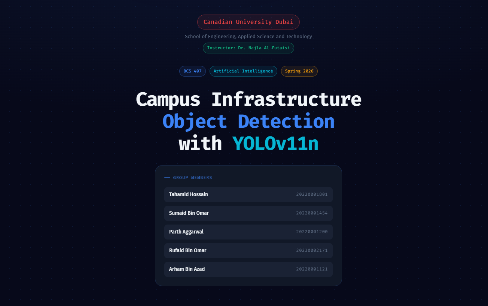
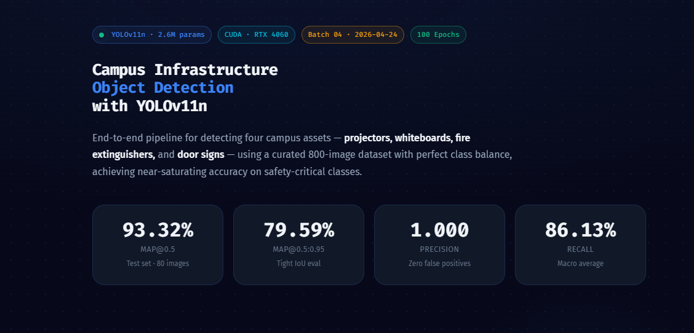

# Campus Infrastructure Object Detection — YOLOv11n / YOLOv11s

Detect four campus assets in real time — **projectors, whiteboards, fire extinguishers, and door signs** — using lightweight YOLOv11 models trained on a curated, class-balanced custom dataset. Built as a reproducible, notebook-driven pipeline from raw images to a deployable ONNX model with a live GPU inference UI.

This repository covers **two project deliverables**:

- **Project 1** — initial YOLOv11n baseline on a v1 dataset (Roboflow + Kaggle, 800 images).
- **Project 2** — three single-variable interventions on top of that baseline: a rebuilt v2 dataset, a YOLOv11s backbone upgrade, and a redesigned ONNX + GPU inference pipeline. Full write-up: [`docs/final_technical_report.md`](docs/final_technical_report.md).

<div align="center">



<br/>



</div>

---

## Headline Results (Project 1 → Project 2)

| Metric | Batch 04 (P1 baseline, n + v1) | Batch 05 (n + v2) | Batch 06 (s + v2, **final**) | Δ (final − baseline) |
|---|---:|---:|---:|---:|
| Test mAP@0.5 | 0.9332 | **0.9876** | 0.9792 | **+0.0460** |
| Test mAP@0.5:0.95 | 0.7959 | 0.8728 | **0.8808** | **+0.0849** |
| Macro recall | 0.8613 | **0.9804** | 0.9647 | **+0.1034** |
| Model latency (ONNX + GPU) | 100–120 ms (PyTorch path) | **15–20 ms** | **20–30 ms** | ≈6–9× faster |
| End-to-end FPS | 4–5 | **35–40** | **30–35** | ≈8× higher |

≈85–90% of the accuracy gain came from the **dataset rebuild**; the backbone upgrade added a localisation-focused gain; the new inference pipeline carried the entire deployment-readiness win. Per-class breakdowns and error analysis: [`docs/final_technical_report.md`](docs/final_technical_report.md).

---

## Trained Models — All Versions

Weights and ONNX exports for inference. Use the **final combined model (Batch 06)** by default; Batch 05 is the lightweight YOLOv11n alternative on the same v2 dataset.

| Batch | Backbone | Dataset | `best.pt` | `best.onnx` | Role |
|---|---|---|---|---|---|
| 01 | YOLOv11n | v1 (early) | `model_outputs/01_training_batch_2_00am_23_04_2026/weights/best.pt` | — | Early sanity run |
| 02 | YOLOv11n | v1 | `model_outputs/02_training_batch_3_00pm_24_04_2026/weights/best.pt` | `…/best.onnx` | Iteration |
| 03 | YOLOv11n | v1 | (no weights retained) | — | Aborted run |
| **04** | **YOLOv11n** | **v1** | `model_outputs/04_training_batch_1_48am_24_04_2026/weights/best.pt` | `…/best.onnx` | **Project 1 baseline** |
| **05** | **YOLOv11n** | **v2** | `model_outputs/05_training_batch_12_06am_12_05_2026/weights/best.pt` · `05_model_weights/best.pt` | `…/best.onnx` · `05_model_weights/best.onnx` | **Project 2 — dataset uplift** (lightweight) |
| **06** | **YOLOv11s** | **v2** | `model_outputs/06_training_batch_1_09am_12_05_2026/weights/best.pt` · `06_model_weights/best.pt` | `…/best.onnx` · `06_model_weights/best.onnx` | **Project 2 — final combined model** |

> The `05_model_weights/` and `06_model_weights/` directories at the repo root mirror the latest exported weights so the inference notebook (`06_live_inference.ipynb`) can load them without digging into the timestamped run folders.

---

## Dataset Evolution (v1 → v2)

**v1** (Project 1): 800 images sourced from Roboflow Universe + Kaggle, capped to 200/class. `fire_extinguisher` was over-sourced (848 source pairs vs. 200–319 elsewhere) so the cap-to-200 step left a narrow style slice; `projector` and `whiteboard` recall trailed by ~20 pp.

**v2** (Project 2): rebuilt custom corpus that adds new HUB-campus captures, rebalances source pools to 238–249 across all four classes, prunes empty-label scenes, re-checks boxes, and broadens the box-area distribution by varying capture distance.

| | v1 (Batch 04) | v2 (Batches 05 + 06) |
|---|---|---|
| Source pairs (proj / wb / fe / ds) | 319 / 200 / 848 / 240 | **249 / 238 / 248 / 244** |
| Train images / boxes | 560 / 695 | 560 / **810** |
| Val boxes | 200 | **229** |
| Test boxes | 102 | **112** |
| Empty labels (all splits) | 35 | **23** |

Total annotated boxes climb from 997 → 1,151 (+15.4%) at constant image count. Per-class and per-split tables: [`docs/final_technical_report.md §4.3`](docs/final_technical_report.md).

---

## Improvement Strategies Applied (Project 2 brief catalogue)

| Cat. | # | Strategy | Realisation |
|---|---|---|---|
| A | 1 | Backbone upgrade | YOLOv11n (2.6 M) → **YOLOv11s** (9.4 M, 21.6 GFLOPs) — Batch 06 |
| A | 2 | Pretrained init | All runs start from `yolo11n.pt` / `yolo11s.pt` COCO weights |
| A | 4 | Early stop + regularisation | `patience = 15`, weight decay 5e-4 (Batch 05 stopped at ep 87) |
| B | 5 | Targeted class expansion | New HUB captures aimed at the worst v1 classes (`projector`, `whiteboard`) |
| B | 7 | Re-annotate / clean labels | v2 prunes empty scenes, re-checks boxes |
| B | 8 | Class balance | Source pools rebalanced to 238–249 / class |
| C | 10 | Multi-scale coverage | Captures shot at varied subject distances |
| C | 11 | Confidence-threshold calibration | Threshold slider exposed in the live UI |

---

## Pipeline — Run Notebooks in Order

| # | Notebook | Stage | Output |
|---|---|---|---|
| 01 | `notebooks/01_data_collection.ipynb` | Aggregate per-class to ~200/class | `data/aggregated/<class>/{images,labels}` + `info.json` |
| 02 | `notebooks/02_data_annotation.ipynb` | Stratified 70/20/10 split + class remapping | `data/dataset/{images,labels}/{train,val,test}` + `data.yaml` |
| 03 | `notebooks/03_data_preprocessing_split.ipynb` | Health diagnostics (read-only) | Class-balance, box-area, leakage reports |
| 04 | `notebooks/04_model_training.ipynb` | Train YOLOv11n / YOLOv11s | `runs/detect/train*/weights/best.pt` |
| 05 | `notebooks/05_model_evaluation.ipynb` | Test-set metrics, confusion matrix, PR/F1 curves | `overall_metrics.json`, `per_class_metrics.csv` |
| 06 | `notebooks/06_live_inference.ipynb` | Inference on image / video / webcam (ONNX + GPU UI) | live overlay |
| 07 | `notebooks/07_export_onnx.ipynb` | Export `best.pt` → `best.onnx` (opset 12, dynamic axes) | `weights/best.onnx` |
| 08 | `notebooks/08_export_docs.ipynb` | Build interactive dashboard | `docs/index.html` |

---

## Setup

```bash
python -m venv .venv
.venv\Scripts\Activate.ps1                       # Windows PowerShell
# source .venv/bin/activate                      # macOS / Linux

pip install torch torchvision torchaudio --index-url https://download.pytorch.org/whl/cu126
pip install ultralytics==8.3.* onnx onnxruntime-gpu pandas pillow matplotlib seaborn pyyaml ipykernel

.venv\Scripts\python -m ipykernel install --user --name=ai_cv_project --display-name "Python (.venv)"
```

The training notebook auto-detects **CUDA → MPS → CPU**. Reference environment for the published numbers: Windows 11 · RTX 4060 · CUDA 12.6 / cuDNN 9.10.2 · Python 3.13.12 · PyTorch 2.11.0+cu126 · Ultralytics 8.3.253 · seed 42 (deterministic).

---

## Reproducing Each Batch

All three Project 2 batches share the same training recipe (`imgsz=640`, `batch=16`, SGD `lr0=0.01`, `lrf=0.01`, momentum 0.937, weight decay 5e-4, mosaic 1.0 closed last 10 ep, HSV-S 0.7 / HSV-V 0.4, fliplr 0.5, randaugment, erasing 0.4, box 7.5 / cls 0.5 / dfl 1.5, AMP on, seed 42, `patience=15`, `epochs=100`).

### 1. Build the v1 dataset (Batch 04 baseline)

```bash
# Drop per-class Roboflow/Kaggle exports under datasets/<class>/<dataset_N>/
# (each with train/valid/test/data.yaml). Then:
jupyter execute notebooks/01_data_collection.ipynb     # cap ~200/class
jupyter execute notebooks/02_data_annotation.ipynb     # stratified split + remap
jupyter execute notebooks/03_data_preprocessing_split.ipynb   # diagnostics
```

### 2. Build the v2 dataset (Batches 05 + 06)

Same notebooks, but the `datasets/<class>/` folders should now include the rebalanced source pools (HUB-campus captures + curated Roboflow/Kaggle pulls). Re-run notebooks 01 → 03; the resulting `data/dataset/` is the v2 corpus shared by Batches 05 and 06.

### 3. Train

Edit the model selector in `notebooks/04_model_training.ipynb`:

| Batch | Dataset | `model=` line |
|---|---|---|
| 04 (Project 1 baseline) | v1 | `yolo11n.pt` |
| 05 (Project 2, dataset uplift) | v2 | `yolo11n.pt` |
| 06 (Project 2, final combined) | v2 | `yolo11s.pt` |

```bash
jupyter execute notebooks/04_model_training.ipynb
```

Run logs land in `runs/detect/train*/`; promote the run by copying the folder into `model_outputs/<NN>_training_batch_<timestamp>/`.

### 4. Evaluate on the held-out test split

```bash
jupyter execute notebooks/05_model_evaluation.ipynb
```

Writes per-class CSV, overall JSON, confusion matrices, and PR / F1 curves under `model_outputs/<batch>/docs/nb05_model_evaluation/`.

### 5. Export ONNX (for the GPU inference pipeline)

```bash
jupyter execute notebooks/07_export_onnx.ipynb        # opset 12, dynamic axes
```

### 6. Live inference

```bash
jupyter execute notebooks/06_live_inference.ipynb
```

Loads `05_model_weights/best.onnx` or `06_model_weights/best.onnx` (configurable in the notebook), runs on image / video / webcam with a confidence-threshold slider. ≈30–40 FPS end-to-end on an RTX 4060.

### 7. Build the docs dashboard

```bash
jupyter execute notebooks/08_export_docs.ipynb        # → docs/index.html
```

---

## Repo Layout

```
ai_cv_project/
├── notebooks/                  # 01 → 08 pipeline
├── datasets/<class>/           # raw per-class exports (gitignored contents)
├── data/
│   ├── aggregated/<class>/     # per-class 200-cap pool
│   └── dataset/                # final stratified split + data.yaml
├── model_outputs/              # one folder per training batch
│   ├── 01_training_batch_2_00am_23_04_2026/
│   ├── 02_training_batch_3_00pm_24_04_2026/
│   ├── 03_training_batch_10_15pm_24_04_2026/
│   ├── 04_training_batch_1_48am_24_04_2026/   # Project 1 baseline
│   ├── 05_training_batch_12_06am_12_05_2026/  # Project 2, n + v2
│   └── 06_training_batch_1_09am_12_05_2026/   # Project 2, s + v2 (final)
├── 05_model_weights/           # latest n+v2  best.pt + best.onnx
├── 06_model_weights/           # latest s+v2  best.pt + best.onnx (final)
├── scripts/                    # docs + annotation helpers
└── docs/
    ├── final_technical_report.md            # Project 2 deliverable
    ├── batch04_vs_batch05/                  # 2-way single-variable contrast
    ├── batch04_vs_batch05_vs_batch06/       # 3-way single-variable contrast
    ├── PROJECT_GUIDE.md
    ├── training_metrics_glossary.md
    └── index.html                           # interactive dashboard
```

---

## Experiments Log — All Runs

Single table summarising every training run in `model_outputs/`. Hyperparameters not listed are constant across all batches: SGD `lr0=0.01`, `lrf=0.01`, momentum 0.937, weight decay 5e-4, warmup 3 ep, mosaic 1.0 (closed last 10 ep), HSV-S 0.7, HSV-V 0.4, fliplr 0.5, randaugment, erasing 0.4, box 7.5 / cls 0.5 / dfl 1.5, AMP on, seed 42, deterministic, `imgsz=640`, `batch=16`, `patience=15`, COCO-pretrained init.

| Run | Date | Backbone | Dataset | Epochs (cap → trained) | Best epoch | Best val mAP@0.5 | Best val mAP@0.5:0.95 | Final train box / cls loss | Final val box / cls loss | Test mAP@0.5 | Test mAP@0.5:0.95 | Test P (macro) | Test R (macro) | Notes |
|---|---|---|---|---|---|---:|---:|---:|---:|---:|---:|---:|---:|---|
| 01 | 2026-04-23 02:00 | YOLOv11n | v1 (early) | — | — | — | — | — | — | — | — | — | — | First sanity run; only `best.pt` retained. |
| 02 | 2026-04-24 03:00 | YOLOv11n | v1 | — | — | — | — | — | — | — | — | — | — | Iteration; `best.pt` + `best.onnx` retained, no metric JSON preserved. |
| 03 | 2026-04-24 22:15 | YOLOv11n | v1 | — | — | — | — | — | — | — | — | — | — | Aborted run; weights folder empty. |
| **04** | 2026-04-24 01:48 | **YOLOv11n** (2.6 M, 6.5 GFLOPs) | **v1** (800 img, 997 boxes) | 100 → 100 | 60 | 0.9489 | 0.7251 | 0.5109 / 0.3839 | 0.8409 / 0.5516 | **0.9332** | **0.7959** | **1.0000** | **0.8613** | **Project 1 baseline.** |
| **05** | 2026-05-12 00:06 | **YOLOv11n** (2.6 M, 6.5 GFLOPs) | **v2** (800 img, 1,151 boxes) | 100 → **87** (early stop) | 70 | **0.9874** | 0.8134 | 0.5632 / 0.3976 | 0.6743 / 0.4186 | **0.9876** | 0.8728 | **1.0000** | **0.9804** | **P2 — dataset uplift.** Single biggest jump on every headline metric. |
| **06** | 2026-05-12 01:09 | **YOLOv11s** (9.4 M, 21.6 GFLOPs) | **v2** (same as 05) | 100 → 100 | **83** | 0.9820 | **0.8394** | **0.4186 / 0.2298** | **0.6505 / 0.3342** | 0.9792 | **0.8808** | 0.9924 | 0.9647 | **P2 — final combined model.** Wins strict-IoU macro; small `door_sign` precision regression. |

Per-class test metrics (the four classes that matter — `projector` / `whiteboard` / `fire_extinguisher` / `door_sign`):

| Run | P (per class) | R (per class) | mAP@0.5 (per class) | mAP@0.5:0.95 (per class) |
|---|---|---|---|---|
| 04 | 1.000 / 1.000 / 1.000 / 1.000 | 0.804 / 0.763 / 0.957 / 0.922 | 0.896 / 0.876 / 0.978 / 0.982 | 0.729 / 0.777 / 0.905 / 0.773 |
| 05 | 1.000 / 1.000 / 1.000 / 1.000 | **1.000** / 0.950 / **1.000** / **0.971** | **0.995** / 0.975 / **0.995** / **0.986** | 0.938 / 0.941 / 0.876 / 0.736 |
| 06 | 1.000 / 1.000 / 1.000 / 0.970 | 0.944 / **1.000** / **1.000** / 0.914 | 0.972 / **0.995** / **0.995** / 0.955 | **0.940** / **0.972** / 0.871 / 0.740 |

Inference-pipeline measurements (RTX 4060, 640×640, same hardware across both paths):

| Run | Project 1 path latency (eager PyTorch) | Project 2 path latency (ONNX + GPU) | End-to-end FPS (Project 2 path) | ONNX size (FP32, simplified) |
|---|---:|---:|---:|---:|
| 04 (n + v1) | 100–120 ms | 15–20 ms | 35–40 | ~10.4 MB |
| 05 (n + v2) | 100–120 ms | 15–20 ms | 35–40 | ~10.4 MB |
| 06 (s + v2) | 170–200 ms | 20–30 ms | 30–35 | ~36 MB |

Source artefacts for every cell above: `model_outputs/<batch>/docs/nb04_model_training/training_summary.json` (training metrics), `…/nb04_model_training/training_config.yaml` (hyperparameters), `…/nb05_model_evaluation/overall_metrics.json` (overall test metrics), `…/nb05_model_evaluation/per_class_metrics.csv` (per-class test metrics).

---

## Reports & Documentation

- **Project 2 final technical report** — [`docs/final_technical_report.md`](docs/final_technical_report.md)
- Two-way comparison (Batch 04 vs 05 — dataset uplift in isolation) — [`docs/batch04_vs_batch05/technical_report.md`](docs/batch04_vs_batch05/technical_report.md)
- Three-way comparison (Batch 04 vs 05 vs 06 — dataset + backbone decomposed) — [`docs/batch04_vs_batch05_vs_batch06/technical_report.md`](docs/batch04_vs_batch05_vs_batch06/technical_report.md)
- Pipeline guide — [`docs/PROJECT_GUIDE.md`](docs/PROJECT_GUIDE.md)
- Metrics glossary — [`docs/training_metrics_glossary.md`](docs/training_metrics_glossary.md)
- Interactive dashboard — [`docs/index.html`](docs/index.html)
