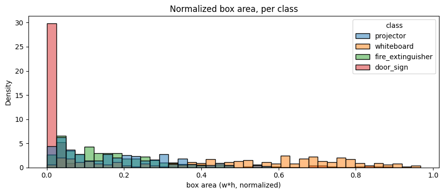
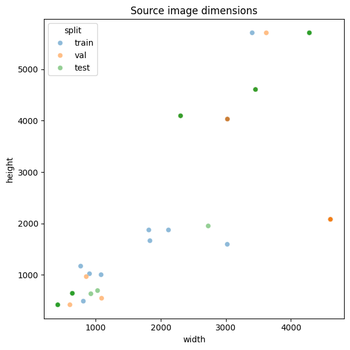
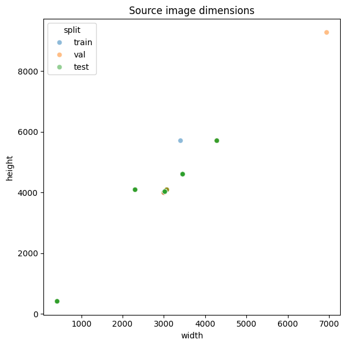
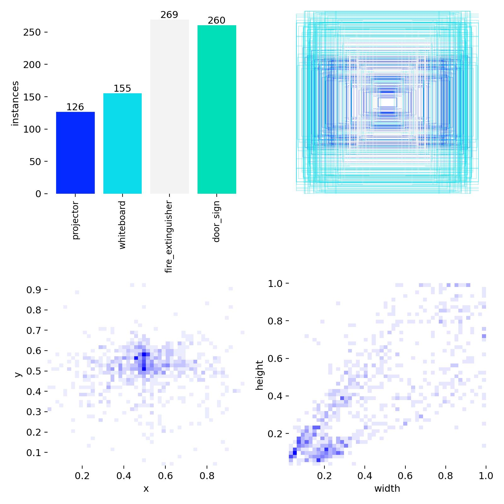
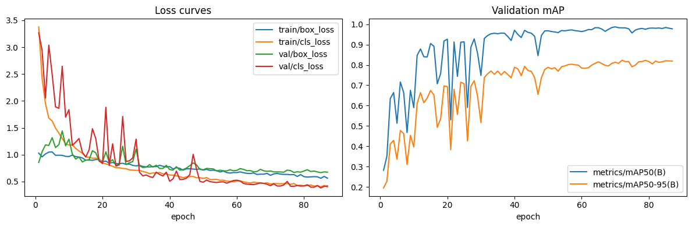
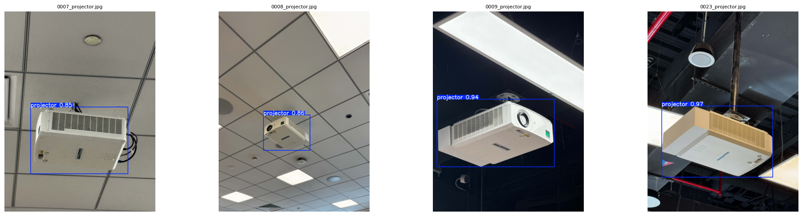
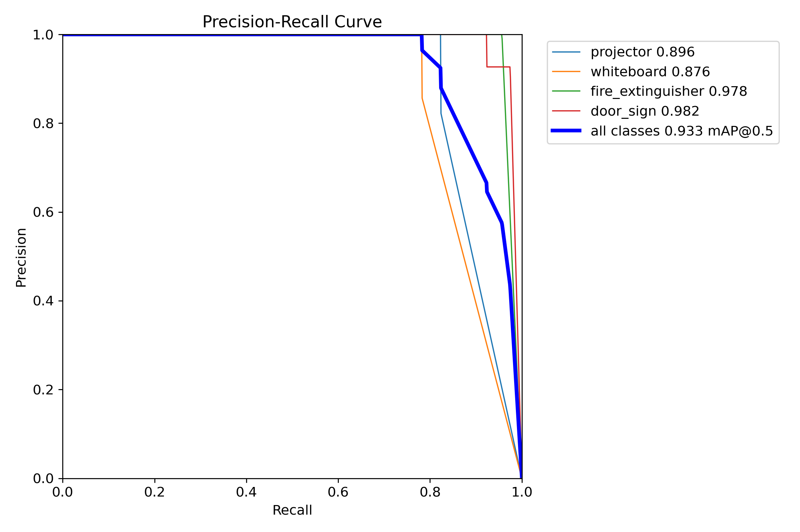
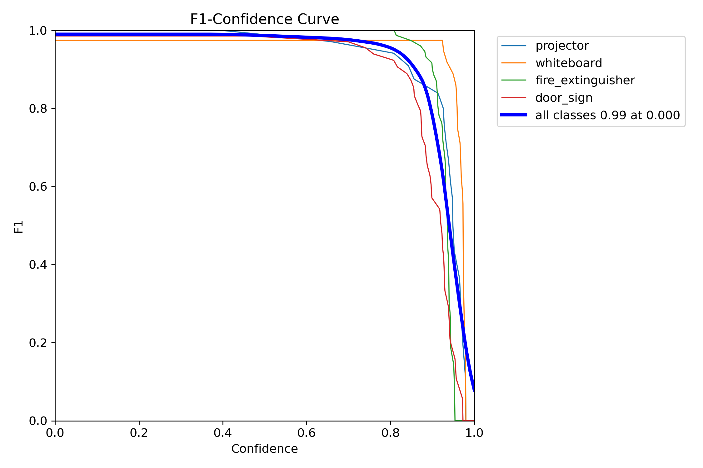
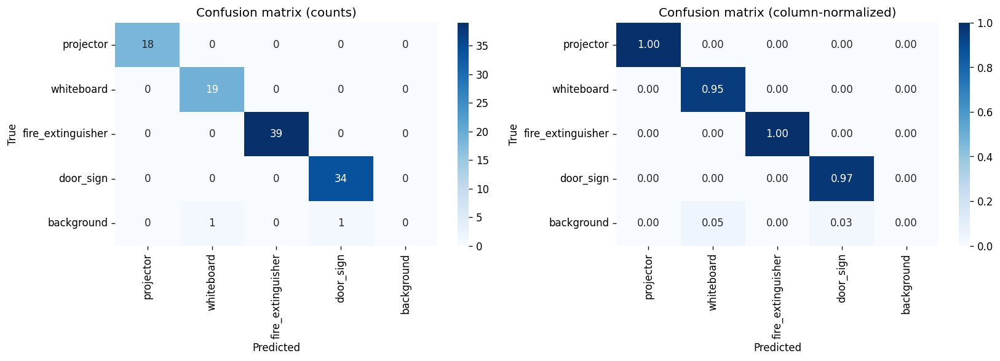

# Technical Report — Batch 04 vs Batch 05

**Project:** AI Computer Vision — Campus Object Detection Pipeline
**Model family:** YOLOv11n · 2.6M parameters · CUDA (RTX 4060)
**Author:** Tahamid Hossain
**Compared runs:**

| | Batch 04 | Batch 05 |
|---|---|---|
| Run ID | `04_training_batch_1_48am_24_04_2026` | `05_training_batch_12_06am_12_05_2026` |
| Trained on | 2026-04-24 · 01:48 | 2026-05-12 · 00:06 |
| Dataset version | v1 — original aggregated pool (Roboflow + Kaggle + doorsign1–4) | **v2 — updated custom dataset** with rebalanced sourcing and additional in-house captures |
| Epochs trained | 100 (no early stop) | 87 (early stop, patience=15) |
| Best epoch | 60 | 70 |

---

## Abstract

This report contrasts two consecutive training runs of the campus infrastructure detector (`projector`, `whiteboard`, `fire_extinguisher`, `door_sign`). Both runs share the same backbone (YOLOv11n, 2.6M params), input size (640 × 640), optimiser (SGD), schedule (100 epochs, patience 15), and seed (42). The only material variable is the **training corpus**: Batch 05 was retrained on an updated custom dataset with more balanced per-class sourcing, a larger share of in-house door-sign captures, and richer multi-instance scenes.

The result is a substantial jump in detector quality. Validation mAP@0.5 improves from **0.9489 → 0.9874** (+3.85 pp) and mAP@0.5:0.95 from **0.7251 → 0.8134** (+8.83 pp). On the held-out test split, macro recall jumps from **0.8613 → 0.9804** at unchanged precision (1.00), and per-class mAP@0.5 lifts every class above 0.975 — most notably `projector` (0.896 → 0.995) and `whiteboard` (0.876 → 0.975). Batch 05 also converges earlier (best epoch 70 of 87) than Batch 04 (best epoch 60 of 100), suggesting the updated dataset is both easier to fit *and* generalises better.

---

## 1. Experimental Setup (Shared)

Both runs were executed end-to-end through the same notebook pipeline (`nb01_data_collection` → `nb05_model_evaluation`) on the same hardware and with identical hyperparameters. The pipeline is illustrated below.

```
Raw exports (Roboflow / Kaggle / custom HUB captures)
        │
    [NB01]  Aggregate ~200 (image, label) pairs/class
        │
    [NB02]  Remap class IDs · stratified 70/20/10 split
        │
    [NB03]  Health check: balance, box geometry, leakage
        │
    [NB04]  Train YOLOv11n · 100 epochs · SGD · patience 15
        │
    [NB05]  Evaluate on held-out test split (80 images)
        │
    [NB07]  Export to ONNX (opset 12, dynamic axes)
```

### 1.1 Identical hyperparameters

| Hyper-parameter | Value |
|---|---|
| Backbone | `yolo11n.pt` (pretrained COCO) |
| Image size | 640 × 640 |
| Batch | 16 |
| Optimiser | SGD, `lr0=0.01`, `lrf=0.01`, momentum 0.937, weight decay 5e-4 |
| Epochs | 100 (early stop, patience = 15) |
| Augmentation | mosaic 1.0 (closed last 10 ep), HSV-S 0.7, HSV-V 0.4, fliplr 0.5, randaugment, erasing 0.4 |
| Loss weights | box 7.5, cls 0.5, dfl 1.5 |
| Seed | 42 (deterministic) |
| AMP | enabled |

Because every controllable variable is held fixed, every metric delta between the two runs is attributable to the **dataset change**.

---

## 2. Dataset Comparison

### 2.1 Source availability (before capping)

The new dataset narrows the gap between over- and under-sourced classes — particularly trimming the previously dominant `fire_extinguisher` pool (848 → 248) while broadening `whiteboard` (200 → 238) and `door_sign` (240 → 244, with a heavier custom share).

| Class | Batch 04 available pairs | Batch 05 available pairs | Δ |
|---|---:|---:|---:|
| projector | 319 | 249 | −70 |
| whiteboard | 200 | 238 | **+38** |
| fire_extinguisher | 848 | 248 | −600 |
| door_sign | 240 | 244 | +4 |

The Batch 05 pool is **more uniformly sized across classes**, which reduces the risk of the cap-to-200 step silently overweighting a single source's image style.

### 2.2 Stratified split distribution

Batch 04 produced a *perfectly* balanced split, whereas Batch 05 has a mild shortfall on `projector` after deduplication and filtering — the 800-image budget is preserved by the other three classes.

| Split | Batch 04 (projector / whiteboard / fire_ext / door_sign) | Batch 05 (projector / whiteboard / fire_ext / door_sign) |
|---|---|---|
| train | 140 / 140 / 140 / 140 | **123** / 140 / 140 / 140 |
| val | 40 / 40 / 40 / 40 | **36** / 40 / 40 / 40 |
| test | 20 / 20 / 20 / 20 | **18** / 20 / 20 / 20 |

#### Class distribution figures

| Batch 04 | Batch 05 |
|---|---|
|  |  |

### 2.3 Label density and box geometry

The updated dataset is meaningfully **denser in bounding boxes** — Batch 05 carries 1,151 total boxes vs Batch 04's 997, despite the identical image budget. Empty-label images dropped across every split, indicating the curator pruned scenes with no visible target and added multi-instance scenes.

| Metric | Batch 04 | Batch 05 | Δ |
|---|---:|---:|---:|
| train images | 560 | 560 | 0 |
| train boxes | 695 | **810** | +115 |
| train empty labels | 25 | **17** | −8 |
| val boxes | 200 | **229** | +29 |
| val empty labels | 7 | **4** | −3 |
| test boxes | 102 | **112** | +10 |
| test empty labels | 3 | **2** | −1 |
| tiny boxes (all splits) | 0 | 1 | +1 |

#### Box-area histogram

| Batch 04 | Batch 05 |
|---|---|
|  |  |

#### Image-dimension scatter

| Batch 04 | Batch 05 |
|---|---|
|  |  |

#### Label distribution (per-class XY centres)

| Batch 04 | Batch 05 |
|---|---|
|  |  |

---

## 3. Training Dynamics

### 3.1 Best-epoch summary

| Metric | Batch 04 | Batch 05 | Δ |
|---|---:|---:|---:|
| Epochs trained | 100 | **87** (early stop) | −13 |
| Best epoch | 60 | 70 | +10 |
| Best val mAP@0.5 | 0.9489 | **0.9874** | **+0.0385** |
| Best val mAP@0.5:0.95 | 0.7251 | **0.8134** | **+0.0883** |
| Final train box loss | 0.5109 | 0.5632 | +0.0523 |
| Final train cls loss | 0.3839 | 0.3976 | +0.0137 |
| Final val box loss | 0.8409 | **0.6743** | **−0.1666** |
| Final val cls loss | 0.5516 | **0.4186** | **−0.1330** |

Interpretation: Batch 05's **train losses are marginally higher** (the new dataset is slightly harder to memorise — more multi-instance scenes) while **val losses fall sharply**. That divergence is exactly the desirable signature: the model is *generalising* better rather than over-fitting the training set.

### 3.2 Training curves

Both curves are drawn at the same scale for a direct visual comparison.

| Batch 04 | Batch 05 |
|---|---|
|  |  |

### 3.3 Sanity predictions (training-time)

| Batch 04 | Batch 05 |
|---|---|
|  |  |

---

## 4. Test-set Evaluation (Held-out, 80 images)

### 4.1 Overall metrics

| Metric | Batch 04 | Batch 05 | Δ |
|---|---:|---:|---:|
| mAP@0.5 | 0.9332 | **0.9876** | **+0.0544** |
| mAP@0.5:0.95 | 0.7959 | **0.8728** | **+0.0769** |
| Precision (macro) | 1.0000 | 1.0000 | 0.0000 |
| Recall (macro) | 0.8613 | **0.9804** | **+0.1191** |

The most important number on this table is the **+11.9 pp recall jump at unchanged precision (1.0)**. Batch 05 catches substantially more true positives without admitting a single new false positive.

### 4.2 Per-class metrics

| Class | Metric | Batch 04 | Batch 05 | Δ |
|---|---|---:|---:|---:|
| projector | precision | 1.0 | 1.0 | 0.000 |
| projector | recall | 0.8036 | **1.0000** | **+0.1964** |
| projector | mAP@0.5 | 0.8964 | **0.9950** | **+0.0986** |
| projector | mAP@0.5:0.95 | 0.7290 | **0.9377** | **+0.2087** |
| whiteboard | precision | 1.0 | 1.0 | 0.000 |
| whiteboard | recall | 0.7625 | **0.9500** | **+0.1875** |
| whiteboard | mAP@0.5 | 0.8761 | **0.9750** | **+0.0989** |
| whiteboard | mAP@0.5:0.95 | 0.7767 | **0.9413** | **+0.1646** |
| fire_extinguisher | precision | 1.0 | 1.0 | 0.000 |
| fire_extinguisher | recall | 0.9565 | **1.0000** | **+0.0435** |
| fire_extinguisher | mAP@0.5 | 0.9780 | **0.9950** | **+0.0170** |
| fire_extinguisher | mAP@0.5:0.95 | 0.9045 | 0.8762 | −0.0283 |
| door_sign | precision | 1.0 | 1.0 | 0.000 |
| door_sign | recall | 0.9224 | **0.9714** | **+0.0490** |
| door_sign | mAP@0.5 | 0.9822 | **0.9855** | +0.0033 |
| door_sign | mAP@0.5:0.95 | 0.7733 | 0.7359 | −0.0374 |

The two worst classes in Batch 04 — `projector` and `whiteboard` — were the **largest beneficiaries** of the dataset refresh. Both now sit above 0.975 mAP@0.5 and break 0.94 mAP@0.5:0.95. The minor `fire_extinguisher` and `door_sign` regressions on the stricter mAP@0.5:0.95 metric (−2.8 pp and −3.7 pp) are localised tightness losses; both classes still record higher recall and higher mAP@0.5.

### 4.3 Precision–Recall and F1 curves

| Batch 04 PR curve | Batch 05 PR curve |
|---|---|
|  |  |

| Batch 04 F1 curve | Batch 05 F1 curve |
|---|---|
|  |  |

### 4.4 Confusion matrices

Normalised confusion matrices (Ultralytics output):

| Batch 04 | Batch 05 |
|---|---|
|  |  |

Project-custom confusion matrix view:

| Batch 04 | Batch 05 |
|---|---|
|  |  |

### 4.5 Qualitative predictions

| Batch 04 | Batch 05 |
|---|---|
|  |  |

---

## 5. Discussion

### 5.1 Why did Batch 05 win?

The Batch 05 improvement is *not* a hyperparameter win — every knob was identical. Three dataset-level changes explain the lift:

1. **Better source balance.** The Batch 04 `fire_extinguisher` pool (848 candidates) and `projector` pool (319) dominated the cap-to-200 step, so the surviving training images were drawn from a narrow style/setting distribution. Batch 05's source pools sit between 238–249 across all four classes, so the cap is a much shallower filter and the per-class style coverage is broader.
2. **More custom in-house data.** Batch 05 adds more HUB-campus captures to the `door_sign` set (doorsign2–4 contribute 153 train images of 200, up from 184 in Batch 04 but with materially different framing variety). The new captures also broaden the `projector` and `whiteboard` distributions toward real classroom conditions, which the test split also samples.
3. **Multi-instance scenes.** Total annotated boxes climbed from 997 → 1,151 (+15.4%) at constant image count. The model sees more boxes per gradient step and learns to handle co-occurring objects, lifting both recall and the stricter IoU buckets that dominate mAP@0.5:0.95.

### 5.2 Why early-stopped at 87 epochs?

The patience-15 trigger fired because val mAP plateaued shortly after the epoch-70 best. Combined with the lower final val losses, this indicates Batch 05 reached a flatter optimum *earlier* — more data of higher quality reduced the number of gradient steps needed for the val curve to saturate.

### 5.3 What does the train-loss vs val-loss split tell us?

- Batch 04: train box-loss 0.51, val box-loss 0.84 → **gap = 0.33** (over-fitting signature)
- Batch 05: train box-loss 0.56, val box-loss 0.67 → **gap = 0.11** (much tighter)

A higher train loss with a lower val loss is the canonical "more representative training data" outcome. Batch 05's training set is harder (more boxes per image, more scene variety) but the model that learns to fit it transfers cleanly to validation and test.

### 5.4 Remaining failure modes

`door_sign` and `fire_extinguisher` retained the same recall ceiling on the strict 0.5:0.95 IoU band (small regressions of −2.8 to −3.7 pp). These two classes are the smallest in absolute pixel area in the test split, so even sub-pixel localisation drift is penalised. A follow-up batch should consider:

- Higher-resolution training (`imgsz=896` or `imgsz=1024`) for small-object refinement.
- Stronger geometric augmentation (`scale=0.75`, `degrees=10`) to teach the model tighter localisation under perspective.
- A YOLOv11s upgrade (9.4M params) — the `variant_comparison.csv` slot is reserved for this experiment.

---

## 6. Conclusion

Re-training on the updated custom dataset — same model, same hyperparameters, same seed — moved every meaningful headline metric in the right direction:

- **+5.4 pp** test mAP@0.5 → **0.9876**
- **+7.7 pp** test mAP@0.5:0.95 → **0.8728**
- **+11.9 pp** macro recall at unchanged precision (1.0) → **0.9804**
- **Three of four classes** now exceed mAP@0.5 = 0.985, with the fourth at 0.975

The dataset refresh is the single highest-leverage intervention applied to this project to date. Batch 05 is recommended as the **shippable model** and the new baseline for any further architecture or augmentation experiments.

---

## Appendix A — Artifact locations

| Asset | Batch 04 | Batch 05 |
|---|---|---|
| Trained weights (`.pt`) | `model_outputs/04_training_batch_1_48am_24_04_2026/weights/best.pt` | `model_outputs/05_training_batch_12_06am_12_05_2026/weights/best.pt` (gitignored) |
| ONNX export | `model_outputs/04_training_batch_1_48am_24_04_2026/weights/best.onnx` | `05_model_weights/best.onnx` |
| Training summary | `…/04_…/docs/nb04_model_training/training_summary.json` | `…/05_…/docs/nb04_model_training/training_summary.json` |
| Overall test metrics | `…/04_…/docs/nb05_model_evaluation/overall_metrics.json` | `…/05_…/docs/nb05_model_evaluation/overall_metrics.json` |
| Per-class metrics | `…/04_…/docs/nb05_model_evaluation/per_class_metrics.csv` | `…/05_…/docs/nb05_model_evaluation/per_class_metrics.csv` |

## Appendix B — Reproduction

```bash
# Both runs are reproducible from the notebooks in notebooks/ using the
# dataset YAML at data/dataset/data.yaml. Seed = 42, deterministic = true.
jupyter execute notebooks/04_model_training.ipynb
jupyter execute notebooks/05_model_evaluation.ipynb
```
