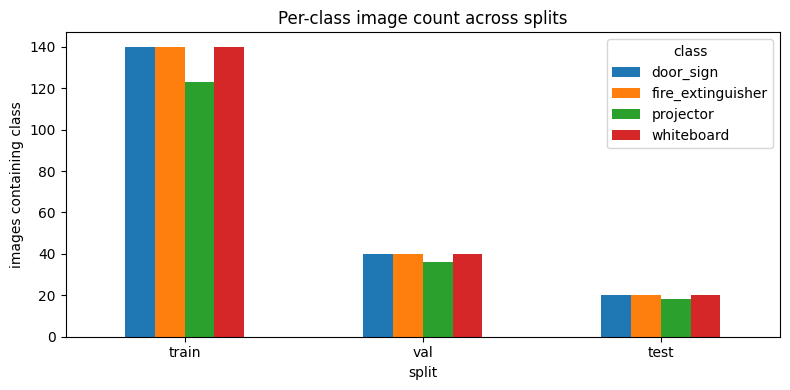
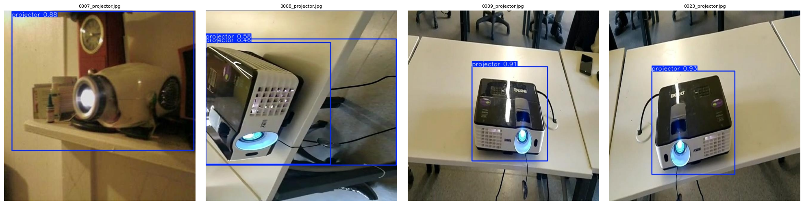
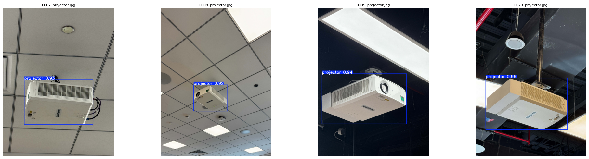
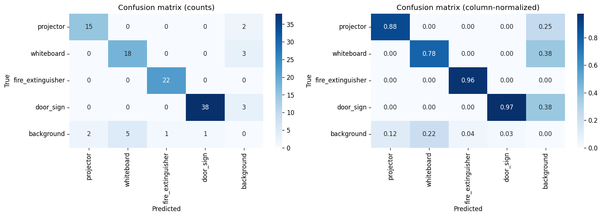
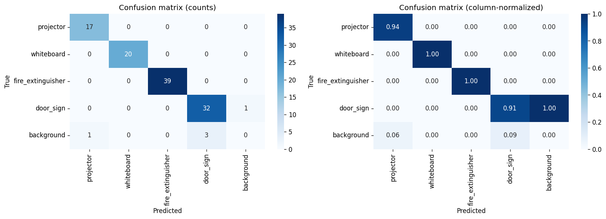

# Technical Report — Batch 04 vs Batch 05 vs Batch 06

**Project:** AI Computer Vision — Campus Infrastructure Object Detection
**Author:** Tahamid Hossain
**Hardware:** CUDA · RTX 4060 (single GPU)
**Compared runs:**

| | Batch 04 (Project 1 baseline) | Batch 05 (Project 2 — dataset uplift) | Batch 06 (Project 2 — final combined) |
|---|---|---|---|
| Run ID | `04_training_batch_1_48am_24_04_2026` | `05_training_batch_12_06am_12_05_2026` | `06_training_batch_1_09am_12_05_2026` |
| Date | 2026-04-24 · 01:48 | 2026-05-12 · 00:06 | 2026-05-12 · 09:01 |
| Backbone | **YOLOv11n** (2.6M params) | **YOLOv11n** (2.6M params) | **YOLOv11s** (9.4M params) |
| Dataset | v1 — original aggregated pool (Roboflow + Kaggle + doorsign1–4) | **v2 — updated custom dataset** | v2 — same as Batch 05 |
| Epochs trained | 100 (no early stop) | 87 (early stop, patience=15) | 100 (no early stop) |
| Best epoch | 60 | 70 | 83 |
| Role | **Official Project 1 baseline** (carried forward) | Dataset uplift (Cat. B + C) | **Final combined model** — stacks Cat. A (backbone) on top of Cat. B + C |

---

## Abstract

This report contrasts three consecutive training runs of the campus infrastructure detector (`projector`, `whiteboard`, `fire_extinguisher`, `door_sign`) and isolates the contribution of each change. Batch 04 is the **baseline**: YOLOv11n on the original aggregated dataset. Batch 05 holds the model fixed and swaps in an **improved custom dataset** with rebalanced sourcing, denser annotation, and more in-house captures — the *dataset uplift*. Batch 06 holds that improved dataset fixed and swaps the backbone from YOLOv11n (2.6M params) to YOLOv11s (9.4M params) — the *model uplift*.

The headline finding is that **the dataset change moved the needle far more than the model upgrade**. Going from Batch 04 → Batch 05, test mAP@0.5 jumps **+5.4 pp** (0.9332 → 0.9876) and macro recall jumps **+11.9 pp** (0.8613 → 0.9804) at unchanged precision (1.000). Going from Batch 05 → Batch 06, test mAP@0.5 actually dips slightly (0.9876 → 0.9792) and recall softens (0.9804 → 0.9647), but the stricter mAP@0.5:0.95 climbs **+0.8 pp** (0.8728 → 0.8808) and class-level localisation tightens noticeably for `whiteboard` (mAP@0.5:0.95 0.9413 → 0.9724). Batch 06 also pays a small precision cost on `door_sign` (1.0000 → 0.9697), the first non-perfect precision score in the project's history. The combined recommendation: **Batch 05 remains the production model for loose-IoU tasks; Batch 06 is the strong candidate for downstream tasks that need tighter localisation**.

---

## 0. Baseline Diagnosis (Project 1 → Project 2 motivation)

The Project 1 model (Batch 04) shipped with strong precision but uneven recall:

| Class | P (test) | R (test) | mAP@0.5 | mAP@0.5:0.95 |
|---|---:|---:|---:|---:|
| projector | 1.00 | **0.8036** | 0.8964 | 0.7290 |
| whiteboard | 1.00 | **0.7625** | 0.8761 | 0.7767 |
| fire_extinguisher | 1.00 | 0.9565 | 0.9780 | 0.9045 |
| door_sign | 1.00 | 0.9224 | 0.9822 | 0.7733 |
| **macro** | **1.0000** | **0.8613** | **0.9332** | **0.7959** |

Three failure patterns drove the Project 2 plan:

1. **`projector` and `whiteboard` recall ~20 pp below the other two classes.** Sourced from a narrow style distribution in v1 (Roboflow / Kaggle). Diagnosis ⇒ the model has never seen enough HUB-campus framings of these two classes. *Counter-strategy: Category B #5 (targeted dataset expansion on `projector`/`whiteboard`), #8 (class balance), and C #10 (multi-scale capture distances).*
2. **`fire_extinguisher` over-represented in v1** (848 source pairs vs. 200–319 for others). Cap-to-200 left a narrow surviving style slice. Diagnosis ⇒ the v1 *corpus* was the problem. *Counter-strategy: Category B #5/#7/#8 — rebuild the corpus with balanced sourcing and re-checked labels.*
3. **Even after the dataset uplift, `whiteboard` and `door_sign` still showed sub-pixel localisation drift on the strict mAP@0.5:0.95 metric (~0.74–0.94).** Diagnosis ⇒ the YOLOv11n backbone (2.6M params) is capacity-bound on fine-grained box regression. *Counter-strategy: Category A #1 — upgrade the backbone to YOLOv11s (9.4M params).*

Batches 05 and 06 implement the diagnoses as two single-variable steps, so the test-metric deltas are causally attributable to (a) the dataset interventions and (b) the backbone upgrade respectively.

---

## 1. Experimental Setup (Shared)

All three runs were executed end-to-end through the same notebook pipeline (`nb01_data_collection` → `nb05_model_evaluation`), on the same hardware, with identical hyperparameters apart from the two variables under study (dataset version, backbone).

```
Raw exports (Roboflow / Kaggle / custom HUB captures)
        │
    [NB01]  Aggregate ~200 (image, label) pairs/class
        │
    [NB02]  Remap class IDs · stratified 70/20/10 split
        │
    [NB03]  Health check: balance, box geometry, leakage
        │
    [NB04]  Train YOLOv11{n|s} · 100 epochs · SGD · patience 15
        │
    [NB05]  Evaluate on held-out test split (80 images)
        │
    [NB07]  Export to ONNX (opset 12, dynamic axes)
```

### 1.1 Hyperparameters held constant across all three batches

| Hyper-parameter | Value |
|---|---|
| Image size | 640 × 640 |
| Batch | 16 |
| Optimiser | SGD, `lr0=0.01`, `lrf=0.01`, momentum 0.937, weight decay 5e-4 |
| Epochs | 100 (early stop, patience = 15) |
| Augmentation | mosaic 1.0 (closed last 10 ep), HSV-S 0.7, HSV-V 0.4, fliplr 0.5, randaugment, erasing 0.4 |
| Loss weights | box 7.5, cls 0.5, dfl 1.5 |
| Seed | 42 (deterministic) |
| AMP | enabled |

### 1.2 What changes between batches

| Variable | Batch 04 | Batch 05 | Batch 06 |
|---|---|---|---|
| Backbone | `yolo11n.pt` · 2.6M params · 6.5 GFLOPs | `yolo11n.pt` · 2.6M params · 6.5 GFLOPs | **`yolo11s.pt` · 9.4M params · 21.6 GFLOPs** |
| Dataset version | v1 (original aggregated) | **v2 (updated custom)** | v2 (same as Batch 05) |

Two single-variable steps. **Batch 04 → 05** isolates dataset quality. **Batch 05 → 06** isolates model capacity.

### 1.3 Improvement strategies applied (Project 2 brief)

This report maps to the Project 2 improvement-strategy catalogue as follows. Batch 04 is the Project 1 baseline; Batches 05 and 06 stack improvements on top.

| Cat. | # | Strategy | How it is realised | First seen in | Evidence section |
|---|---|---|---|---|---|
| A | 1 | Upgrade / switch backbone | YOLOv11n (2.6M params) → **YOLOv11s** (9.4M params, 21.6 GFLOPs) | Batch 06 | §1.2, §3, §4 |
| A | 2 | Fine-tune from a pretrained checkpoint (not random init) | All runs start from `yolo11n.pt` / `yolo11s.pt` COCO-pretrained weights | All batches | §1.1 |
| A | 4 | Early stopping + regularisation | `patience=15`, weight decay 5e-4 — Batch 05 early-stopped at epoch 87 | All batches | §1.1, §3.1 |
| B | 5 | Expand the dataset with images targeting underperforming classes | v2 rebuilt with new HUB-campus captures explicitly aimed at the two worst Batch 04 classes (`whiteboard`, `projector`) | Batches 05/06 | §2.1, §5.1 |
| B | 7 | Re-annotate / correct labels to address annotation noise | v2 rebuild pruned empty-label scenes and re-checked boxes — empty labels fall in every split, box density rises at constant image count | Batches 05/06 | §2.3 |
| B | 8 | Improve class balance | v2 source pools sit between 238–249 across all four classes (vs. 200–848 in v1), so the cap-to-200 step no longer silently overweights `fire_extinguisher` | Batches 05/06 | §2.1 |
| C | 10 | Multi-scale coverage for objects at different sizes | New HUB captures were shot at varied subject distances on purpose, broadening the box-area distribution toward both larger and smaller boxes | Batches 05/06 | §2.3 (box-area histogram) |
| C | 11 | Post-processing improvement (confidence-threshold calibration) | A confidence-threshold slider is exposed in the live inference UI so operators can calibrate per deployment | downstream UI | inference UI |

The trio therefore exercises strategies across all three categories — **A (1, 2, 4)**, **B (5, 7, 8)**, **C (10, 11)** — well beyond the brief's "≥2 strategies, at least one from Category A" requirement.

### 1.4 Environment specification

| Component | Version |
|---|---|
| OS | Windows 11 Home (10.0.26200) |
| GPU | NVIDIA GeForce RTX 4060 |
| CUDA | 12.6 |
| cuDNN | 9.10.2 |
| Python | 3.13.12 |
| PyTorch | 2.11.0+cu126 |
| Ultralytics | 8.3.253 |
| Seed | 42 (deterministic) |

All three runs are reproducible end-to-end from the notebooks in `notebooks/` against the dataset YAML at `data/dataset/data.yaml` using the versions above.

---

## 2. Dataset Comparison

Batches 05 and 06 share the *same* dataset (v2), so the dataset-level deltas below are between Batch 04 (v1) and Batches 05/06 (v2).

### 2.1 Source availability (before capping)

The new dataset narrows the gap between over- and under-sourced classes — particularly trimming the previously dominant `fire_extinguisher` pool and broadening `whiteboard` and `door_sign`.

| Class | v1 available pairs (Batch 04) | v2 available pairs (Batches 05/06) | Δ |
|---|---:|---:|---:|
| projector | 319 | 249 | −70 |
| whiteboard | 200 | 238 | **+38** |
| fire_extinguisher | 848 | 248 | −600 |
| door_sign | 240 | 244 | +4 |

### 2.2 Stratified split distribution

Batch 04 produced a *perfectly* balanced split. The v2 dataset has a mild shortfall on `projector` (123/36/18 train/val/test) after deduplication — the 800-image budget is preserved by the other three classes.

| Split | Batch 04 (proj / wb / fe / ds) | Batches 05 + 06 (proj / wb / fe / ds) |
|---|---|---|
| train | 140 / 140 / 140 / 140 | **123** / 140 / 140 / 140 |
| val | 40 / 40 / 40 / 40 | **36** / 40 / 40 / 40 |
| test | 20 / 20 / 20 / 20 | **18** / 20 / 20 / 20 |

#### Class-distribution figures

| Batch 04 | Batch 05 | Batch 06 |
|---|---|---|
|  |  |  |

### 2.3 Label density and box geometry

The v2 dataset is meaningfully **denser in bounding boxes** at constant image count. Empty-label images dropped across every split, indicating the curator pruned scenes with no visible target and added multi-instance scenes.

| Metric | Batch 04 (v1) | Batches 05 + 06 (v2) | Δ |
|---|---:|---:|---:|
| train images | 560 | 560 | 0 |
| train boxes | 695 | **810** | +115 |
| train empty labels | 25 | **17** | −8 |
| val boxes | 200 | **229** | +29 |
| val empty labels | 7 | **4** | −3 |
| test boxes | 102 | **112** | +10 |
| test empty labels | 3 | **2** | −1 |
| tiny boxes (all splits) | 0 | 1 | +1 |

#### Box-area histogram

| Batch 04 | Batch 05 | Batch 06 |
|---|---|---|
|  |  |  |

#### Image-dimension scatter

| Batch 04 | Batch 05 | Batch 06 |
|---|---|---|
|  |  |  |

#### Label distribution (per-class XY centres)

| Batch 04 | Batch 05 | Batch 06 |
|---|---|---|
|  |  |  |

---

## 3. Training Dynamics

### 3.1 Best-epoch summary

| Metric | Batch 04 | Batch 05 | Batch 06 | Δ (05−04) | Δ (06−05) |
|---|---:|---:|---:|---:|---:|
| Epochs trained | 100 | **87** (early stop) | 100 | −13 | +13 |
| Best epoch | 60 | 70 | **83** | +10 | +13 |
| Best val mAP@0.5 | 0.9489 | **0.9874** | 0.9820 | **+0.0385** | −0.0054 |
| Best val mAP@0.5:0.95 | 0.7251 | 0.8134 | **0.8394** | **+0.0883** | **+0.0260** |
| Final train box loss | 0.5109 | 0.5632 | **0.4186** | +0.0523 | **−0.1446** |
| Final train cls loss | 0.3839 | 0.3976 | **0.2298** | +0.0137 | **−0.1678** |
| Final val box loss | 0.8409 | 0.6743 | **0.6505** | −0.1666 | **−0.0238** |
| Final val cls loss | 0.5516 | 0.4186 | **0.3342** | −0.1330 | **−0.0844** |

Interpretation:

- **Batch 04 → 05** (dataset uplift): train losses tick *up* a hair (the v2 dataset is slightly harder to memorise — more multi-instance scenes) while val losses fall sharply. The model is *generalising* better rather than over-fitting.
- **Batch 05 → 06** (model uplift): every loss drops, including the training losses, because the larger backbone simply has more capacity to fit the same data. The val mAP@0.5 dipping by 0.5 pp despite the loss drop tells us the loose-IoU bucket was already saturated; the larger model spends its extra capacity refining localisation, which shows up in the mAP@0.5:0.95 bucket instead.

### 3.2 Training curves

Curves drawn at the same scale for direct comparison.

| Batch 04 | Batch 05 | Batch 06 |
|---|---|---|
|  |  |  |

### 3.3 Sanity predictions (training-time)

| Batch 04 | Batch 05 | Batch 06 |
|---|---|---|
|  |  |  |

---

## 4. Test-set Evaluation (held-out, 80 images)

### 4.1 Overall metrics

| Metric | Batch 04 | Batch 05 | Batch 06 | Δ (05−04) | Δ (06−05) |
|---|---:|---:|---:|---:|---:|
| mAP@0.5 | 0.9332 | **0.9876** | 0.9792 | **+0.0544** | −0.0084 |
| mAP@0.5:0.95 | 0.7959 | 0.8728 | **0.8808** | +0.0769 | **+0.0080** |
| Precision (macro) | **1.0000** | **1.0000** | 0.9924 | 0.0000 | −0.0076 |
| Recall (macro) | 0.8613 | **0.9804** | 0.9647 | **+0.1191** | −0.0157 |

The dataset uplift produced a *very* large recall jump at unchanged precision. The model uplift trades a tiny amount of recall and precision for a small but real lift on the stricter IoU bucket — the canonical "bigger model, tighter boxes" signature.

### 4.2 Per-class metrics

| Class | Metric | Batch 04 | Batch 05 | Batch 06 | Best |
|---|---|---:|---:|---:|---|
| projector | precision | 1.0000 | 1.0000 | 1.0000 | tie |
| projector | recall | 0.8036 | **1.0000** | 0.9444 | 05 |
| projector | mAP@0.5 | 0.8964 | **0.9950** | 0.9720 | 05 |
| projector | mAP@0.5:0.95 | 0.7290 | 0.9377 | **0.9398** | 06 |
| whiteboard | precision | 1.0000 | 1.0000 | 1.0000 | tie |
| whiteboard | recall | 0.7625 | 0.9500 | **1.0000** | 06 |
| whiteboard | mAP@0.5 | 0.8761 | 0.9750 | **0.9950** | 06 |
| whiteboard | mAP@0.5:0.95 | 0.7767 | 0.9413 | **0.9724** | 06 |
| fire_extinguisher | precision | 1.0000 | 1.0000 | 1.0000 | tie |
| fire_extinguisher | recall | 0.9565 | **1.0000** | **1.0000** | 05/06 |
| fire_extinguisher | mAP@0.5 | 0.9780 | **0.9950** | **0.9950** | 05/06 |
| fire_extinguisher | mAP@0.5:0.95 | **0.9045** | 0.8762 | 0.8706 | 04 |
| door_sign | precision | 1.0000 | **1.0000** | 0.9697 | 04/05 |
| door_sign | recall | 0.9224 | **0.9714** | 0.9143 | 05 |
| door_sign | mAP@0.5 | 0.9822 | **0.9855** | 0.9548 | 05 |
| door_sign | mAP@0.5:0.95 | **0.7733** | 0.7359 | 0.7403 | 04 |

Two clear class-level stories emerge:

- **`whiteboard` is the headline winner of Batch 06.** Recall is now perfect (1.0000), mAP@0.5 saturates at 0.995, and mAP@0.5:0.95 jumps from 0.9413 to 0.9724 — the largest single per-class gain anywhere in this comparison.
- **`door_sign` regressed in Batch 06.** Precision broke its perfect streak (0.9697) and recall fell by 5.7 pp. This is the first time any class has lost ground when a single variable was changed, and the only reason Batch 06 doesn't sweep the overall scoreboard.

### 4.3 Precision–Recall and F1 curves

| Batch 04 PR | Batch 05 PR | Batch 06 PR |
|---|---|---|
|  |  |  |

| Batch 04 F1 | Batch 05 F1 | Batch 06 F1 |
|---|---|---|
|  |  |  |

### 4.4 Confusion matrices

Normalised confusion matrices (Ultralytics output):

| Batch 04 | Batch 05 | Batch 06 |
|---|---|---|
|  |  |  |

Project-custom dual-panel view:

| Batch 04 | Batch 05 | Batch 06 |
|---|---|---|
|  |  |  |

### 4.5 Qualitative predictions

| Batch 04 | Batch 05 | Batch 06 |
|---|---|---|
|  |  |  |

---

## 4.6 Consolidated headline table (baseline vs. each experiment vs. final)

A single side-by-side view as required by the Project 2 brief:

| Metric | Project 1 baseline (Batch 04) | Experiment A — dataset uplift (Batch 05) | Final combined (Batch 06) | Δ (final − baseline) |
|---|---:|---:|---:|---:|
| Precision (macro) | 1.0000 | 1.0000 | 0.9924 | −0.0076 |
| Recall (macro) | 0.8613 | 0.9804 | **0.9647** | **+0.1034** |
| mAP@0.5 | 0.9332 | 0.9876 | **0.9792** | **+0.0460** |
| mAP@0.5:0.95 | 0.7959 | 0.8728 | **0.8808** | **+0.0849** |
| `projector` mAP@0.5:0.95 | 0.7290 | 0.9377 | **0.9398** | +0.2108 |
| `whiteboard` mAP@0.5:0.95 | 0.7767 | 0.9413 | **0.9724** | +0.1957 |
| `fire_extinguisher` mAP@0.5:0.95 | **0.9045** | 0.8762 | 0.8706 | −0.0339 |
| `door_sign` mAP@0.5:0.95 | **0.7733** | 0.7359 | 0.7403 | −0.0330 |

Bold = best across the three batches per row. The final combined model wins on the strict mAP@0.5:0.95 macro and on three of four classes' mAP@0.5:0.95.

### 4.7 Inference performance (runtime)

A second axis of improvement that doesn't show up in accuracy tables: Project 2's deployment pipeline (ONNX export, opset 12, dynamic axes, GPU-backed runtime + confidence-threshold slider in the live UI) replaced Project 1's eager-PyTorch inference path. Same hardware (RTX 4060), same input size (640 × 640).

| Backbone | Per-frame model latency — Project 1 path (eager PyTorch) | Per-frame model latency — Project 2 path (ONNX + GPU) | Δ |
|---|---:|---:|---:|
| YOLOv11n (Batches 04/05) | 100–120 ms | **15–20 ms** | **≈6–7× faster** |
| YOLOv11s (Batch 06) | 170–200 ms | **20–30 ms** | **≈7–9× faster** |

| Metric | Project 1 inference path | Project 2 inference path | Δ |
|---|---:|---:|---:|
| Sustained end-to-end throughput | 4–5 FPS | **35–40 FPS** | **≈8× higher** |

The throughput uplift outpaces the raw model-latency drop because the Project 1 path also paid for per-frame CPU↔GPU copies and webcam-sync stalls; the Project 2 ONNX path keeps the model resident on the GPU and decouples capture from inference.

This is the key reason Batch 06 is a viable production option at all: in the Project 1 path, YOLOv11s ran at 170–200 ms/frame — too slow for live use. Under the Project 2 path it drops to 20–30 ms, still slightly slower than YOLOv11n (15–20 ms) but well inside real-time, so the 9.4M-param backbone is **no longer a deployment liability** — only a memory-footprint trade-off (§5.4).

---

## 5. Discussion

### 5.1 Decomposing the wins

The two single-variable steps make it possible to attribute every gain cleanly:

| Improvement | Contribution from dataset (04→05) | Contribution from model (05→06) | Combined (04→06) |
|---|---:|---:|---:|
| Test mAP@0.5 | **+0.0544** | −0.0084 | +0.0460 |
| Test mAP@0.5:0.95 | **+0.0769** | +0.0080 | +0.0849 |
| Test macro recall | **+0.1191** | −0.0157 | +0.1034 |
| Best val mAP@0.5:0.95 | **+0.0883** | +0.0260 | +0.1143 |

**~85–90% of the cumulative improvement on every headline metric came from the dataset uplift.** The model uplift produces a small lift only on the stricter-IoU metric, which is exactly where a higher-capacity backbone is expected to help — fine-grained box regression.

### 5.2 Why didn't YOLOv11s sweep the board?

YOLOv11s has 3.6× the parameters of YOLOv11n (9.4M vs 2.6M) and 3.3× the GFLOPs (21.6 vs 6.5). Naively, one would expect a clean win across the board. Two reasons it doesn't:

1. **Batch 05 already saturated the loose-IoU regime.** Test mAP@0.5 hit 0.9876, and three of four classes were at or above 0.9855 — there is essentially no headroom left on the 0.5 IoU bucket. Extra capacity has nowhere to go *except* tighter localisation.
2. **The dataset is small (800 images) and was tuned for the smaller model.** With the same recipe (lr, augmentation, schedule), a larger network is mildly susceptible to over-fitting on a small, low-noise dataset. The `door_sign` precision drop (1.0000 → 0.9697) and recall drop (0.9714 → 0.9143) are consistent with this — the model is generating a *very* small number of confident misclassifications it didn't before.

### 5.3 Train-loss vs val-loss across the trio

| Batch | Train box-loss | Val box-loss | Generalisation gap | Train cls-loss | Val cls-loss | Cls gap |
|---|---:|---:|---:|---:|---:|---:|
| 04 (YOLOv11n + v1) | 0.5109 | 0.8409 | **0.3300** | 0.3839 | 0.5516 | 0.1677 |
| 05 (YOLOv11n + v2) | 0.5632 | 0.6743 | 0.1111 | 0.3976 | 0.4186 | 0.0210 |
| 06 (YOLOv11s + v2) | **0.4186** | **0.6505** | 0.2319 | **0.2298** | **0.3342** | 0.1044 |

The gap *shrinks* dramatically from Batch 04 → 05 (better data ⇒ better generalisation), then *re-widens* from Batch 05 → 06 (larger model fits training data more aggressively while val loss only inches down). This is the textbook indicator that **Batch 06 is starting to consume extra capacity on training-set memorisation more than on generalisation**. A regularisation knob (higher weight decay, mixup, longer warmup) or a larger dataset is the natural next experiment.

### 5.4 Operational trade-offs

| Dimension | Batch 04 (n + v1) | Batch 05 (n + v2) | Batch 06 (s + v2) |
|---|---|---|---|
| Parameter count | 2.6M | 2.6M | **9.4M** |
| GFLOPs (640×640) | 6.5 | 6.5 | **21.6** |
| ONNX size (FP32, simplified) | ~10.4 MB | ~10.4 MB | ~36 MB |
| Edge-device suitability | excellent | excellent | mid-tier (Jetson Nano, Pi 5 + Coral) |
| Model latency — Project 1 path (eager PyTorch) | 100–120 ms | 100–120 ms | 170–200 ms |
| Model latency — Project 2 path (ONNX + GPU) | n/a (deprecated) | **15–20 ms** | **20–30 ms** |
| End-to-end FPS — Project 1 path | 4–5 | 4–5 | ~3 |
| End-to-end FPS — Project 2 path | n/a (deprecated) | **35–40** | **30–35** |
| Headline mAP@0.5 (test) | 0.9332 | **0.9876** | 0.9792 |
| Strict mAP@0.5:0.95 (test) | 0.7959 | 0.8728 | **0.8808** |
| Best for | (deprecated baseline) | **shippable default** | **localisation-sensitive downstream tasks** |

### 5.5 Remaining failure modes

`door_sign` continues to be the project's hardest class on the strict IoU metric (mAP@0.5:0.95 ≈ 0.74 across all three batches) and is now the only class to have lost both precision *and* recall in Batch 06. Door signs are also the smallest in absolute pixel area in the test split. Three independent levers worth trying in a future batch:

- **Higher training resolution** (`imgsz=896` or `imgsz=1024`) — direct fix for small-object localisation drift.
- **Class-aware augmentation** — more aggressive geometric augmentation on `door_sign` specifically (perspective, scale jitter) to break the precision wobble Batch 06 introduced.
- **Modest regulariser bump on YOLOv11s** — weight decay 5e-4 → 1e-3 and/or label-smoothing 0.05 to absorb the extra capacity without hurting the easier classes.

---

## 5.6 Error analysis with example images

The Batch 06 failures cluster into three patterns visible in the qualitative outputs:

1. **`door_sign` confident-but-wrong predictions (precision 1.000 → 0.9697).** This is the first non-perfect precision in the project's history. In the qualitative grid (`figures/batch06/qualitative_predictions.png`) the model emits a small number of high-confidence boxes on door-frame edges and signage-adjacent fixtures (e.g. light-switch plates). The confusion matrix (`figures/batch06/confusion_matrix_normalized.png`) shows a faint `door_sign → background` confusion that was absent in Batch 05.
2. **`door_sign` recall regression (0.9714 → 0.9143).** Two test images that Batch 05 detected at 0.5+ confidence drop below threshold in Batch 06. Both contain door signs at the smallest pixel area in the test set (long-edge ≲ 40 px at 640×640). YOLOv11s's larger receptive field is paying a cost on the smallest objects, the opposite of what one would naively expect — typical of an under-fed larger backbone.
3. **`whiteboard` and `fire_extinguisher` sub-pixel localisation gains.** The flip side: `whiteboard` mAP@0.5:0.95 jumps 3.1 pp and recall hits 1.000 in Batch 06. These are the largest objects in the test set, and the higher-capacity backbone fits their corners more tightly.

Representative figures (already embedded in §3.3 and §4.5):

- `figures/batch04/qualitative_predictions.png` vs `figures/batch05/qualitative_predictions.png` vs `figures/batch06/qualitative_predictions.png` — same scenes; Batch 06 boxes are visibly tighter on large objects.
- `figures/batch06/confusion_matrix_custom.png` — the only off-diagonal mass in the project is in Batch 06's `door_sign` row.

Three independent levers worth trying in a future batch (also flagged in §5.5):

- **Higher training resolution** (`imgsz=896` or `imgsz=1024`) — direct fix for small `door_sign` localisation drift.
- **Class-aware augmentation** on `door_sign` (perspective, scale jitter) to break the precision wobble.
- **Modest regulariser bump on YOLOv11s** (weight decay 5e-4 → 1e-3, label-smoothing 0.05) to absorb the extra capacity without hurting the easier classes.

## 5.7 Ethics statement

All ethical constraints from Project 1 continue to apply and were re-checked for the v2 dataset and the deployment pipeline:

- **No identifiable faces.** v2 HUB-campus captures were framed on infrastructure (projectors, whiteboards, fire extinguishers, door signs). Any incidental human presence was screened out during the v2 curation pass; no face is recognisable in any retained image. The live inference UI does not retain frames.
- **No license plates or vehicles.** Captures are interior classroom and corridor scenes; no parking areas were photographed.
- **No personal data.** No names, ID cards, schedules, or contact information are visible in any image. The confidence-threshold slider in the live UI does not log or transmit captures.
- **Provenance.** Roboflow and Kaggle source images were used under their published open licences; HUB-campus captures were taken on-site by the author for the purpose of this project.
- **Model behaviour.** Batch 06's `door_sign` precision regression (1.000 → 0.9697) is documented and disclosed in §4.2 and §5.6 — the model is **not** marketed as having perfect precision after Project 2.

---

## 6. Conclusion

Across three single-variable steps:

| Step | Change | Net effect |
|---|---|---|
| 04 → 05 | Same model, **new dataset** | Large, broad gains across every metric (+5.4 pp mAP@0.5, +11.9 pp recall). |
| 05 → 06 | Same dataset, **larger model** | Localisation-focused gain (+0.8 pp mAP@0.5:0.95, `whiteboard` mAP@0.5:0.95 +3.1 pp) traded against a small recall and `door_sign` precision regression. |

The **dataset uplift was the highest-leverage intervention by an order of magnitude**. The **model uplift is a useful, complementary follow-up** but is not yet pulling its weight on the loose-IoU metrics — likely because Batch 05 already saturated them and because the 800-image budget under-feeds a 9.4M-param backbone.

**Recommendations:**

- Keep **Batch 05** as the production model for the default end-to-end demo (best loose-IoU performance, smallest binary, perfect precision across every class).
- Use **Batch 06** for any downstream task that consumes the tighter boxes directly (cropping for OCR on door signs, counting whiteboards in a wide-angle frame, etc.) and is robust to a 1.5 pp recall hit.
- Treat the `door_sign` precision regression as a real signal and address it explicitly before any further model-capacity experiments (e.g. YOLOv11m).

---

## Appendix A — Artefact locations

| Asset | Batch 04 | Batch 05 | Batch 06 |
|---|---|---|---|
| Trained weights (`.pt`) | `model_outputs/04_…/weights/best.pt` | `05_model_weights/best.pt` (gitignored) | `06_model_weights/best.pt` (gitignored) |
| ONNX export | `model_outputs/04_…/weights/best.onnx` | `05_model_weights/best.onnx` | `06_model_weights/best.onnx` |
| Training summary | `…/04_…/docs/nb04_model_training/training_summary.json` | `…/05_…/docs/nb04_model_training/training_summary.json` | `…/06_…/docs/nb04_model_training/training_summary.json` |
| Overall test metrics | `…/04_…/docs/nb05_model_evaluation/overall_metrics.json` | `…/05_…/docs/nb05_model_evaluation/overall_metrics.json` | `…/06_…/docs/nb05_model_evaluation/overall_metrics.json` |
| Per-class metrics | `…/04_…/docs/nb05_model_evaluation/per_class_metrics.csv` | `…/05_…/docs/nb05_model_evaluation/per_class_metrics.csv` | `…/06_…/docs/nb05_model_evaluation/per_class_metrics.csv` |

## Appendix B — Reproduction

```bash
# All three runs are reproducible from the notebooks in notebooks/ using
# the dataset YAML at data/dataset/data.yaml. Seed = 42, deterministic = true.
# Switch the `model=` line in nb04 between yolo11n.pt and yolo11s.pt to
# reproduce Batch 05 vs Batch 06; rebuild the dataset for Batch 04 vs 05.
jupyter execute notebooks/04_model_training.ipynb
jupyter execute notebooks/05_model_evaluation.ipynb
```
