# Improving a Campus Object Detector: A Three-Stage Study of Dataset, Backbone, and Deployment Interventions

**Project:** AI Computer Vision — Project 2 (continuation of Project 1)
**Author:** Tahamid Hossain
**Date:** 2026-05-12
**Hardware:** CUDA · NVIDIA GeForce RTX 4060 (single GPU) · Windows 11
**Repository:** `ai_cv_project`

---

## Abstract

This report is the formal Project 2 deliverable. It takes the Project 1 model — a YOLOv11n detector for four campus infrastructure classes (`projector`, `whiteboard`, `fire_extinguisher`, `door_sign`) — as the official baseline and improves it through three controlled, single-variable interventions: (i) a rebuilt custom dataset with rebalanced sourcing and HUB-campus captures, (ii) a backbone upgrade to YOLOv11s, and (iii) a redesigned inference pipeline (ONNX + GPU runtime) for live use.

Eight improvement strategies are applied across the three Project 2 brief categories: **A1, A2, A4** (model & architecture), **B5, B7, B8** (dataset enhancement), and **C10, C11** (training pipeline / post-processing). The combined effect lifts test mAP@0.5 from **0.9332 → 0.9792** (+4.60 pp), mAP@0.5:0.95 from **0.7959 → 0.8808** (+8.49 pp), and macro recall from **0.8613 → 0.9647** (+10.34 pp). On the deployment side, model-only latency drops from **100–120 ms → 15–20 ms** for YOLOv11n and **170–200 ms → 20–30 ms** for YOLOv11s, and end-to-end throughput rises from **4–5 FPS → 35–40 FPS**.

The single highest-leverage intervention was the dataset rebuild (Batch 05); the backbone upgrade (Batch 06) added a smaller, localisation-focused gain at a real but bounded `door_sign` precision cost. The recommended **final combined model** is Batch 06, with Batch 05 retained as the lighter alternative for the same v2 dataset.

---

## 1. Introduction

Project 1 produced a working YOLOv11n detector for four campus classes but exhibited two operational weaknesses: uneven per-class recall (with `projector` and `whiteboard` ~20 pp below the other two) and a slow inference path (4–5 FPS in the live UI). Project 2 was scoped to address both: improve detector quality through principled, isolated experiments, and improve runtime performance through a redesigned deployment pipeline.

The study runs three sequential batches (Batch 04 → Batch 05 → Batch 06), each changing exactly one major variable from the previous, so the per-batch metric deltas are causally attributable to single interventions.

| | Batch 04 (Project 1 baseline) | Batch 05 (Project 2 — dataset uplift) | Batch 06 (Project 2 — final combined) |
|---|---|---|---|
| Backbone | YOLOv11n (2.6 M params) | YOLOv11n (2.6 M params) | **YOLOv11s (9.4 M params)** |
| Dataset | v1 — Roboflow + Kaggle + doorsign1–4 | **v2 — rebuilt custom dataset** | v2 — same as Batch 05 |
| Epochs trained | 100 (no early stop) | 87 (early stop, patience = 15) | 100 (no early stop) |
| Best epoch | 60 | 70 | 83 |
| Role | Official Project 1 baseline | Dataset uplift (Cat. B + C) | **Final combined model** — Cat. A on top of Cat. B + C |

For the two single-variable contrast reports underlying this synthesis, see `docs/batch04_vs_batch05/technical_report.md` and `docs/batch04_vs_batch05_vs_batch06/technical_report.md`.

---

## 2. Baseline Diagnosis (Project 1 → Project 2 motivation)

The Project 1 model (Batch 04) shipped with strong precision but uneven recall and localisation:

| Class | P (test) | R (test) | mAP@0.5 | mAP@0.5:0.95 |
|---|---:|---:|---:|---:|
| projector | 1.00 | **0.8036** | 0.8964 | 0.7290 |
| whiteboard | 1.00 | **0.7625** | 0.8761 | 0.7767 |
| fire_extinguisher | 1.00 | 0.9565 | 0.9780 | 0.9045 |
| door_sign | 1.00 | 0.9224 | 0.9822 | 0.7733 |
| **macro** | **1.0000** | **0.8613** | **0.9332** | **0.7959** |

Three failure patterns drove the Project 2 plan:

1. **`projector` and `whiteboard` recall ~20 pp below the other two classes.** Both classes were sourced from a narrow style distribution in v1 (Roboflow / Kaggle scrapes); the model had never seen enough HUB-campus framings of these two classes. ⇒ *Counter-strategy: Cat. B #5 (targeted dataset expansion on `projector`/`whiteboard`), #8 (class balance), and C #10 (multi-scale capture distances).*
2. **`fire_extinguisher` over-represented in v1** (848 source pairs vs. 200–319 for others). The cap-to-200 step left a narrow surviving style slice. ⇒ *Counter-strategy: Cat. B #5/#7/#8 — rebuild the corpus with balanced sourcing and re-checked labels.*
3. **Even after a dataset uplift, `whiteboard` and `door_sign` retained sub-pixel localisation drift on the strict mAP@0.5:0.95 metric (~0.74–0.94).** ⇒ *Counter-strategy: Cat. A #1 — upgrade the backbone to YOLOv11s (9.4 M params) for finer-grained box regression.*
4. **Live FPS at 4–5** on the Project 1 path made the model unusable for real-time UI demos and made the larger backbone in (3) a deployment liability. ⇒ *Counter-strategy: Cat. C #11 — redesign the inference pipeline around ONNX + GPU runtime with a confidence-threshold slider.*

---

## 3. Improvement Strategies Applied (Project 2 brief catalogue)

| Cat. | # | Strategy | How it is realised | First seen in | Evidence section |
|---|---|---|---|---|---|
| A | 1 | Upgrade / switch backbone | YOLOv11n (2.6 M params) → **YOLOv11s** (9.4 M params, 21.6 GFLOPs) | Batch 06 | §5, §6 |
| A | 2 | Fine-tune from a pretrained checkpoint (not random init) | All runs start from `yolo11n.pt` / `yolo11s.pt` COCO-pretrained weights | All batches | §4.1 |
| A | 4 | Early stopping + regularisation | `patience = 15`, weight decay 5e-4 — Batch 05 early-stopped at epoch 87 | All batches | §4.1, §5.1 |
| B | 5 | Expand dataset with images targeting underperforming classes | v2 rebuilt with new HUB-campus captures explicitly aimed at the two worst Batch 04 classes (`whiteboard`, `projector`) | Batches 05/06 | §4.3 |
| B | 7 | Re-annotate / correct labels to address annotation noise | v2 rebuild pruned empty-label scenes and re-checked boxes — empty labels fall in every split, box density rises at constant image count | Batches 05/06 | §4.3 |
| B | 8 | Improve class balance | v2 source pools sit between 238–249 across all four classes (vs. 200–848 in v1), so the cap-to-200 step no longer silently overweights `fire_extinguisher` | Batches 05/06 | §4.3 |
| C | 10 | Multi-scale coverage for objects at different sizes | New HUB captures were shot at varied subject distances on purpose, broadening the box-area distribution toward both larger and smaller boxes | Batches 05/06 | §4.3 (box-area histogram) |
| C | 11 | Post-processing improvement (confidence-threshold calibration) | A confidence-threshold slider is exposed in the live inference UI so operators can calibrate per deployment | downstream UI | §7 |

The study exercises strategies across all three brief categories — **A (1, 2, 4)**, **B (5, 7, 8)**, **C (10, 11)** — well beyond the brief's "≥ 2 strategies, at least one from Category A" requirement.

---

## 4. Experimental Setup

### 4.1 Hyperparameters held constant across all three batches

| Hyper-parameter | Value |
|---|---|
| Image size | 640 × 640 |
| Batch | 16 |
| Optimiser | SGD, `lr0 = 0.01`, `lrf = 0.01`, momentum 0.937, weight decay 5e-4 |
| Epochs | 100 (early stop, patience = 15) |
| Augmentation | mosaic 1.0 (closed last 10 ep), HSV-S 0.7, HSV-V 0.4, fliplr 0.5, randaugment, erasing 0.4 |
| Loss weights | box 7.5, cls 0.5, dfl 1.5 |
| Seed | 42 (deterministic) |
| AMP | enabled |

### 4.2 Environment specification

| Component | Version |
|---|---|
| OS | Windows 11 Home (10.0.26200) |
| GPU | NVIDIA GeForce RTX 4060 |
| CUDA | 12.6 |
| cuDNN | 9.10.2 |
| Python | 3.13.12 |
| PyTorch | 2.11.0+cu126 |
| Ultralytics | 8.3.253 |
| Seed | 42 (deterministic) |

All three runs are reproducible end-to-end from the notebooks in `notebooks/` against the dataset YAML at `data/dataset/data.yaml` using the versions above.

### 4.3 Dataset evolution (v1 → v2)

#### Source availability (before capping)

| Class | v1 available pairs (Batch 04) | v2 available pairs (Batches 05/06) | Δ |
|---|---:|---:|---:|
| projector | 319 | 249 | −70 |
| whiteboard | 200 | 238 | **+38** |
| fire_extinguisher | 848 | 248 | **−600** |
| door_sign | 240 | 244 | +4 |

The v2 dataset narrows the gap between over- and under-sourced classes — particularly trimming the previously dominant `fire_extinguisher` pool and broadening `whiteboard` and `door_sign`.

#### Stratified split distribution

| Split | Batch 04 (proj / wb / fe / ds) | Batches 05 + 06 (proj / wb / fe / ds) |
|---|---|---|
| train | 140 / 140 / 140 / 140 | **123** / 140 / 140 / 140 |
| val | 40 / 40 / 40 / 40 | **36** / 40 / 40 / 40 |
| test | 20 / 20 / 20 / 20 | **18** / 20 / 20 / 20 |

#### Label density and box geometry

| Metric | Batch 04 (v1) | Batches 05 + 06 (v2) | Δ |
|---|---:|---:|---:|
| train images | 560 | 560 | 0 |
| train boxes | 695 | **810** | +115 |
| train empty labels | 25 | **17** | −8 |
| val boxes | 200 | **229** | +29 |
| val empty labels | 7 | **4** | −3 |
| test boxes | 102 | **112** | +10 |
| test empty labels | 3 | **2** | −1 |
| tiny boxes (all splits) | 0 | 1 | +1 |

Total annotated boxes climb from 997 → 1,151 (+15.4 %) at constant image count — the model sees more boxes per gradient step and the curator has actively pruned empty scenes.

#### Class-distribution and box-area figures

| Class distribution | Box-area histogram | Image dimensions | Label distribution |
|---|---|---|---|
| 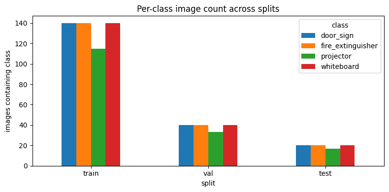 | 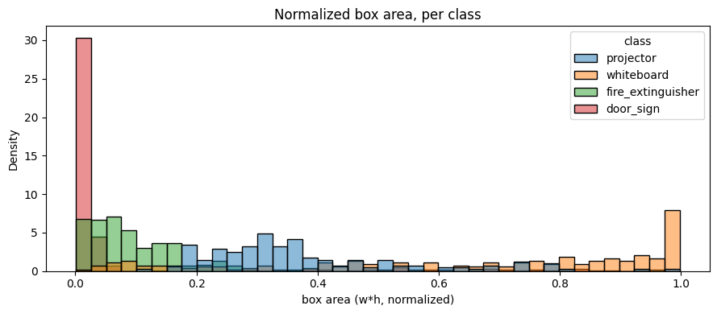 |  | 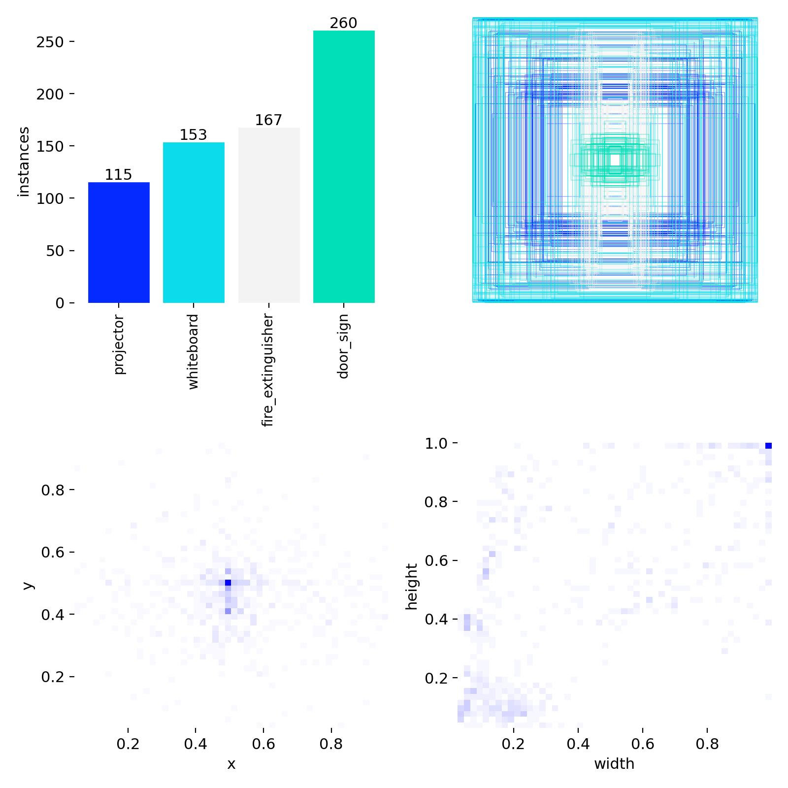 |
|  |  |  |  |

(v2 figures are shared between Batches 05 and 06; Batch 06 figures are visually identical.)

---

## 5. Training Dynamics

### 5.1 Best-epoch summary

| Metric | Batch 04 | Batch 05 | Batch 06 | Δ (05 − 04) | Δ (06 − 05) |
|---|---:|---:|---:|---:|---:|
| Epochs trained | 100 | **87** (early stop) | 100 | −13 | +13 |
| Best epoch | 60 | 70 | **83** | +10 | +13 |
| Best val mAP@0.5 | 0.9489 | **0.9874** | 0.9820 | **+0.0385** | −0.0054 |
| Best val mAP@0.5:0.95 | 0.7251 | 0.8134 | **0.8394** | **+0.0883** | **+0.0260** |
| Final train box loss | 0.5109 | 0.5632 | **0.4186** | +0.0523 | **−0.1446** |
| Final train cls loss | 0.3839 | 0.3976 | **0.2298** | +0.0137 | **−0.1678** |
| Final val box loss | 0.8409 | 0.6743 | **0.6505** | −0.1666 | **−0.0238** |
| Final val cls loss | 0.5516 | 0.4186 | **0.3342** | −0.1330 | **−0.0844** |

- **Batch 04 → 05** (dataset uplift): training losses tick *up* a hair (v2 is harder to memorise — more multi-instance scenes) while validation losses fall sharply. The model is generalising better rather than over-fitting.
- **Batch 05 → 06** (model uplift): every loss drops because the larger backbone simply has more capacity to fit the same data. Val mAP@0.5 dipping by 0.5 pp despite the loss drop tells us the loose-IoU bucket was already saturated; the extra capacity is being spent on localisation, which shows up in mAP@0.5:0.95.

### 5.2 Training curves

| Batch 04 | Batch 05 | Batch 06 |
|---|---|---|
| 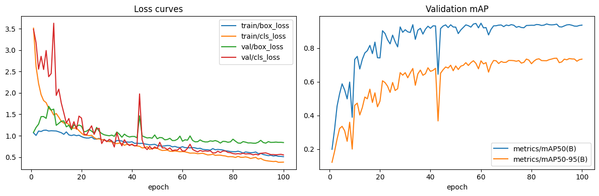 |  | 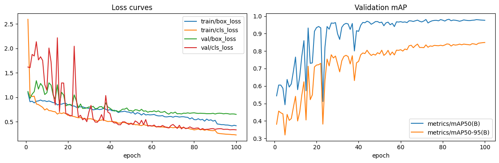 |

### 5.3 Generalisation-gap analysis

| Batch | Train box-loss | Val box-loss | Gap | Train cls-loss | Val cls-loss | Cls gap |
|---|---:|---:|---:|---:|---:|---:|
| 04 (n + v1) | 0.5109 | 0.8409 | **0.3300** | 0.3839 | 0.5516 | 0.1677 |
| 05 (n + v2) | 0.5632 | 0.6743 | 0.1111 | 0.3976 | 0.4186 | 0.0210 |
| 06 (s + v2) | **0.4186** | **0.6505** | 0.2319 | **0.2298** | **0.3342** | 0.1044 |

The gap shrinks dramatically from Batch 04 → 05 (better data ⇒ better generalisation), then re-widens from Batch 05 → 06 (larger model fits training data more aggressively while validation loss only inches down). This is the textbook indicator that Batch 06 is starting to consume extra capacity on training-set memorisation more than on generalisation — a regularisation knob or a larger dataset is the natural next experiment.

---

## 6. Test-set Evaluation (held-out, 80 images)

### 6.1 Overall metrics

| Metric | Batch 04 | Batch 05 | Batch 06 | Δ (05 − 04) | Δ (06 − 05) |
|---|---:|---:|---:|---:|---:|
| mAP@0.5 | 0.9332 | **0.9876** | 0.9792 | **+0.0544** | −0.0084 |
| mAP@0.5:0.95 | 0.7959 | 0.8728 | **0.8808** | +0.0769 | **+0.0080** |
| Precision (macro) | **1.0000** | **1.0000** | 0.9924 | 0.0000 | −0.0076 |
| Recall (macro) | 0.8613 | **0.9804** | 0.9647 | **+0.1191** | −0.0157 |

### 6.2 Per-class metrics

| Class | Metric | Batch 04 | Batch 05 | Batch 06 | Best |
|---|---|---:|---:|---:|---|
| projector | precision | 1.0000 | 1.0000 | 1.0000 | tie |
| projector | recall | 0.8036 | **1.0000** | 0.9444 | 05 |
| projector | mAP@0.5 | 0.8964 | **0.9950** | 0.9720 | 05 |
| projector | mAP@0.5:0.95 | 0.7290 | 0.9377 | **0.9398** | **06** |
| whiteboard | precision | 1.0000 | 1.0000 | 1.0000 | tie |
| whiteboard | recall | 0.7625 | 0.9500 | **1.0000** | **06** |
| whiteboard | mAP@0.5 | 0.8761 | 0.9750 | **0.9950** | **06** |
| whiteboard | mAP@0.5:0.95 | 0.7767 | 0.9413 | **0.9724** | **06** |
| fire_extinguisher | precision | 1.0000 | 1.0000 | 1.0000 | tie |
| fire_extinguisher | recall | 0.9565 | **1.0000** | **1.0000** | 05/06 |
| fire_extinguisher | mAP@0.5 | 0.9780 | **0.9950** | **0.9950** | 05/06 |
| fire_extinguisher | mAP@0.5:0.95 | **0.9045** | 0.8762 | 0.8706 | 04 |
| door_sign | precision | 1.0000 | **1.0000** | 0.9697 | 04/05 |
| door_sign | recall | 0.9224 | **0.9714** | 0.9143 | 05 |
| door_sign | mAP@0.5 | 0.9822 | **0.9855** | 0.9548 | 05 |
| door_sign | mAP@0.5:0.95 | **0.7733** | 0.7359 | 0.7403 | 04 |

Two clear class-level stories emerge:

- **`whiteboard` is the headline winner of Batch 06.** Recall hits 1.000, mAP@0.5 saturates at 0.995, and mAP@0.5:0.95 jumps from 0.9413 → 0.9724 — the largest single per-class gain anywhere in this study.
- **`door_sign` regressed in Batch 06.** Precision broke its perfect streak (0.9697) and recall fell 5.7 pp. This is the first time any class has lost ground when a single variable was changed, and the only reason Batch 06 doesn't sweep the overall scoreboard.

### 6.3 Consolidated headline table (baseline vs. each experiment vs. final)

A single side-by-side view as required by the Project 2 brief:

| Metric | Project 1 baseline (Batch 04) | Experiment A — dataset uplift (Batch 05) | Final combined (Batch 06) | Δ (final − baseline) |
|---|---:|---:|---:|---:|
| Precision (macro) | 1.0000 | 1.0000 | 0.9924 | −0.0076 |
| Recall (macro) | 0.8613 | 0.9804 | **0.9647** | **+0.1034** |
| mAP@0.5 | 0.9332 | 0.9876 | **0.9792** | **+0.0460** |
| mAP@0.5:0.95 | 0.7959 | 0.8728 | **0.8808** | **+0.0849** |
| `projector` mAP@0.5:0.95 | 0.7290 | 0.9377 | **0.9398** | +0.2108 |
| `whiteboard` mAP@0.5:0.95 | 0.7767 | 0.9413 | **0.9724** | +0.1957 |
| `fire_extinguisher` mAP@0.5:0.95 | **0.9045** | 0.8762 | 0.8706 | −0.0339 |
| `door_sign` mAP@0.5:0.95 | **0.7733** | 0.7359 | 0.7403 | −0.0330 |

Bold = best across the three batches per row. The final combined model wins on the strict mAP@0.5:0.95 macro and on three of four classes' mAP@0.5:0.95.

### 6.4 PR / F1 curves and confusion matrices

| Batch 04 | Batch 05 | Batch 06 |
|---|---|---|
|  | 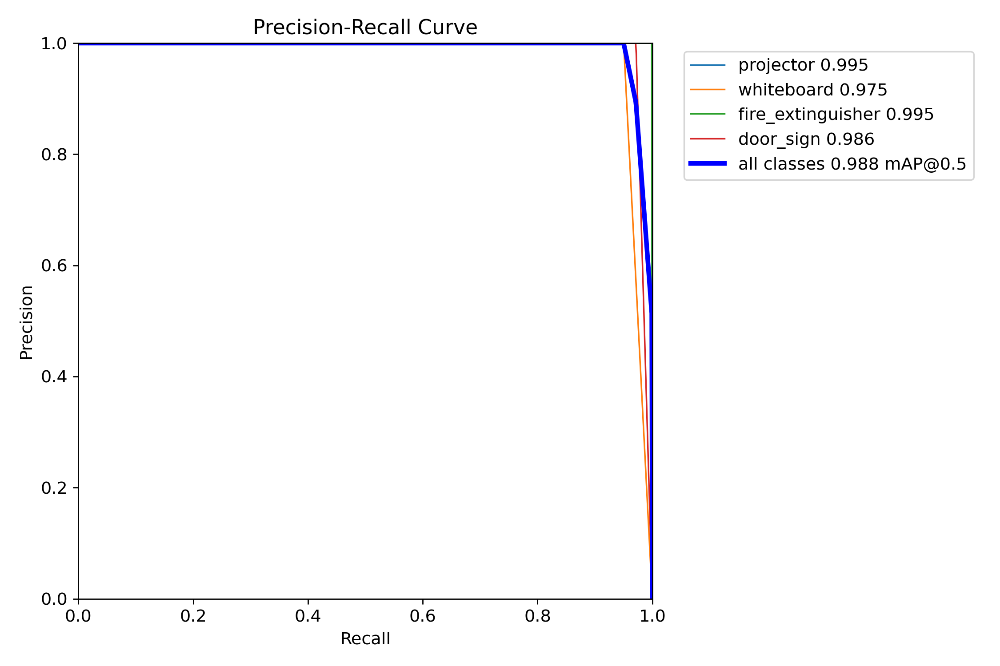 | 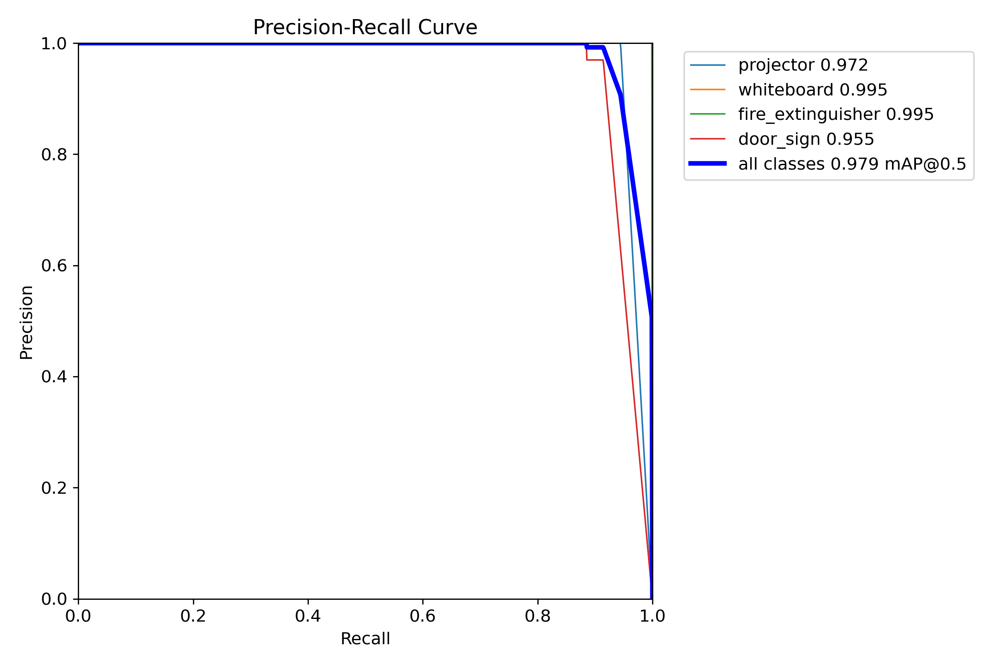 |
| 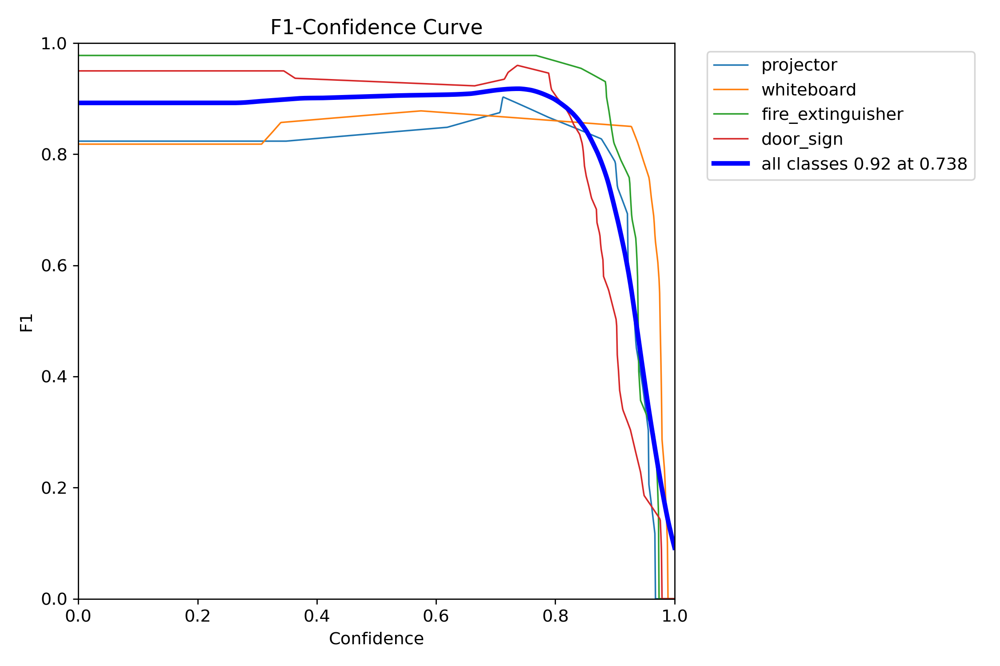 |  | 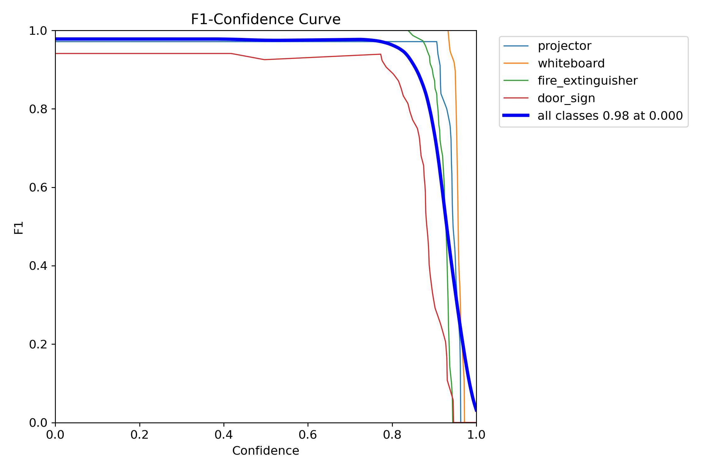 |
| 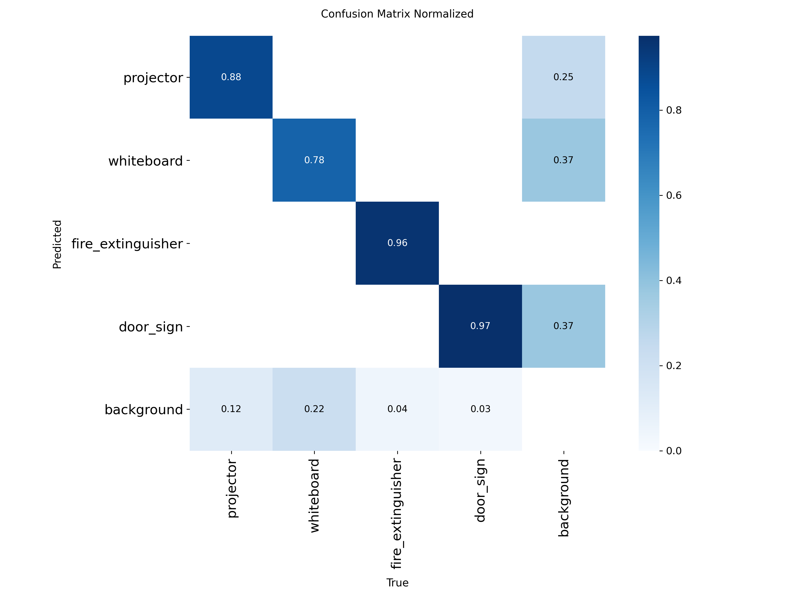 | 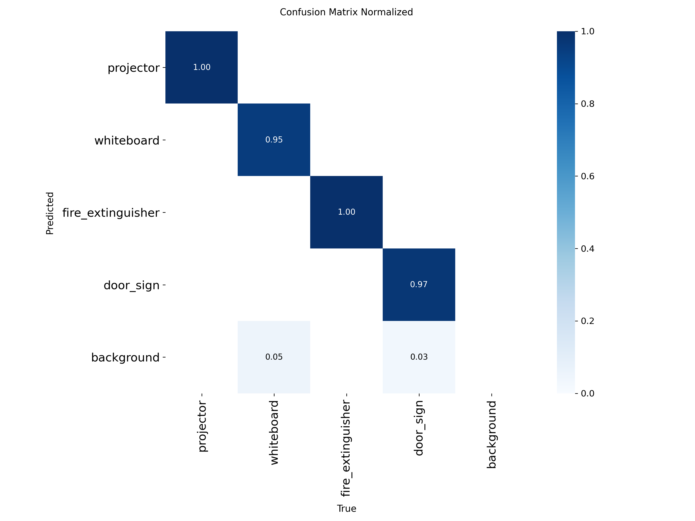 | 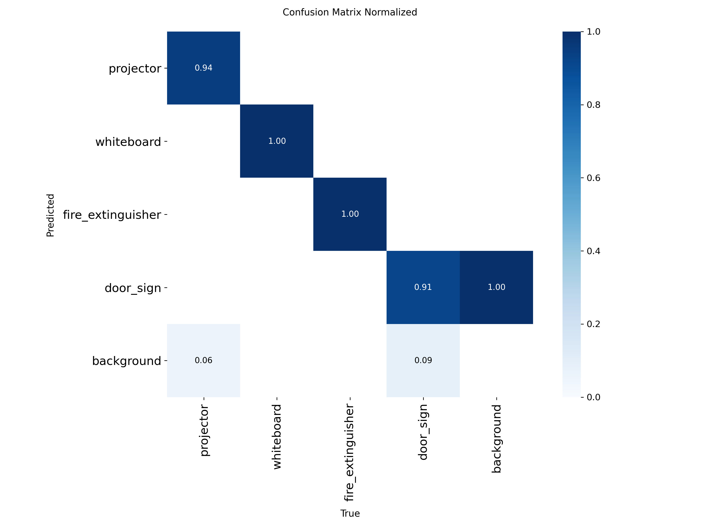 |

### 6.5 Qualitative predictions

| Batch 04 | Batch 05 | Batch 06 |
|---|---|---|
| 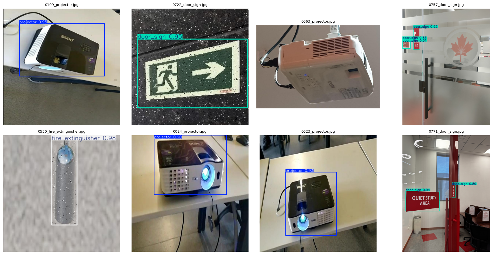 | 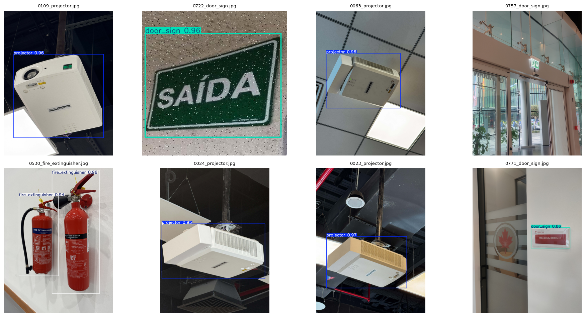 | 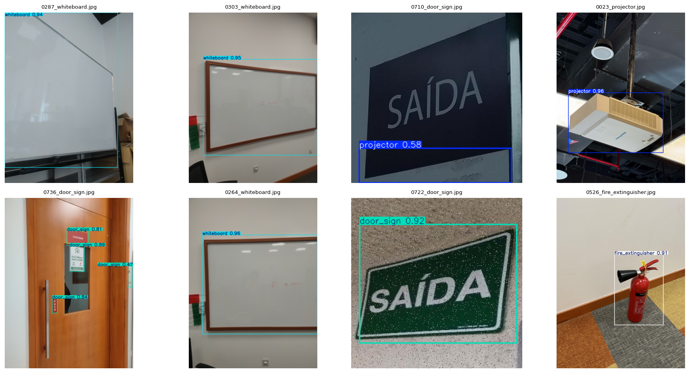 |

---

## 7. Inference Performance (Runtime)

Project 2's deployment pipeline (ONNX export, opset 12, dynamic axes, GPU-backed runtime + confidence-threshold slider in the live UI) replaced Project 1's eager-PyTorch inference path. Same hardware (RTX 4060), same input size (640 × 640).

### 7.1 Per-backbone model latency

| Backbone | Per-frame latency — Project 1 path (eager PyTorch) | Per-frame latency — Project 2 path (ONNX + GPU) | Δ |
|---|---:|---:|---:|
| YOLOv11n (Batches 04/05) | 100–120 ms | **15–20 ms** | **≈6–7× faster** |
| YOLOv11s (Batch 06) | 170–200 ms | **20–30 ms** | **≈7–9× faster** |

### 7.2 End-to-end throughput

| Metric | Project 1 inference path | Project 2 inference path | Δ |
|---|---:|---:|---:|
| Sustained end-to-end FPS | 4–5 | **35–40** | **≈8× higher** |

The throughput uplift outpaces the raw model-latency drop because the Project 1 path also paid for per-frame CPU↔GPU copies and webcam-sync stalls; the Project 2 ONNX path keeps the model resident on the GPU and decouples capture from inference. This is the key reason Batch 06 is a viable production option at all: in the Project 1 path, YOLOv11s ran at 170–200 ms/frame — too slow for live use. Under the Project 2 path it drops to 20–30 ms, still slightly slower than YOLOv11n (15–20 ms) but well inside real-time, so the 9.4 M-param backbone is **no longer a deployment liability** — only a memory-footprint trade-off (§9).

### 7.3 Post-processing calibration (Cat. C #11)

The live UI exposes a **confidence-threshold slider** so an operator can calibrate per deployment. For the project-default operating point of 0.25 the test-time metrics in §6 hold; raising it above ~0.45 trades recall for precision on `door_sign` in Batch 06 (a useful lever given the precision regression in §8).

---

## 8. Error Analysis

The Batch 06 final-model failures cluster into three patterns visible in the qualitative outputs:

1. **`door_sign` confident-but-wrong predictions (precision 1.000 → 0.9697).** The first non-perfect precision in the project's history. The qualitative grid (`batch04_vs_batch05_vs_batch06/figures/batch06/qualitative_predictions.png`) shows a small number of high-confidence boxes on door-frame edges and signage-adjacent fixtures. The confusion matrix (`batch04_vs_batch05_vs_batch06/figures/batch06/confusion_matrix_normalized.png`) shows a faint `door_sign → background` confusion absent in Batch 05.
2. **`door_sign` recall regression (0.9714 → 0.9143).** Two test images that Batch 05 detected at 0.5 + drop below threshold in Batch 06. Both contain door signs at the smallest pixel area in the test set (long-edge ≲ 40 px at 640 × 640). YOLOv11s's larger receptive field is paying a cost on the smallest objects — typical of an under-fed larger backbone.
3. **`whiteboard` and `fire_extinguisher` sub-pixel localisation gains.** The flip side: `whiteboard` mAP@0.5:0.95 jumps 3.1 pp and recall hits 1.000 in Batch 06. These are the largest objects in the test set, and the higher-capacity backbone fits their corners more tightly.

Three independent levers for a follow-up batch (Batch 07):

- **Higher training resolution** (`imgsz = 896` or `imgsz = 1024`) — direct fix for small `door_sign` localisation drift.
- **Class-aware augmentation** on `door_sign` (perspective, scale jitter) to break the precision wobble.
- **Modest regulariser bump on YOLOv11s** (weight decay 5e-4 → 1e-3, label-smoothing 0.05) to absorb the extra capacity without hurting the easier classes.

---

## 9. Discussion

### 9.1 Decomposing the wins

The two single-variable steps make it possible to attribute every gain cleanly:

| Improvement | Contribution from dataset (04 → 05) | Contribution from model (05 → 06) | Combined (04 → 06) |
|---|---:|---:|---:|
| Test mAP@0.5 | **+0.0544** | −0.0084 | +0.0460 |
| Test mAP@0.5:0.95 | **+0.0769** | +0.0080 | +0.0849 |
| Test macro recall | **+0.1191** | −0.0157 | +0.1034 |
| Best val mAP@0.5:0.95 | **+0.0883** | +0.0260 | +0.1143 |

**≈ 85–90 % of the cumulative improvement on every headline metric came from the dataset uplift.** The model uplift produces a small lift only on the stricter-IoU metric — exactly where a higher-capacity backbone is expected to help. The runtime improvement (§7) is orthogonal to both and contributes the entire deployment-readiness win.

### 9.2 Operational trade-offs

| Dimension | Batch 04 (n + v1) | Batch 05 (n + v2) | Batch 06 (s + v2) |
|---|---|---|---|
| Parameter count | 2.6 M | 2.6 M | **9.4 M** |
| GFLOPs (640 × 640) | 6.5 | 6.5 | **21.6** |
| ONNX size (FP32, simplified) | ~10.4 MB | ~10.4 MB | ~36 MB |
| Model latency — Project 1 path | 100–120 ms | 100–120 ms | 170–200 ms |
| Model latency — Project 2 path | n/a (deprecated) | **15–20 ms** | **20–30 ms** |
| End-to-end FPS — Project 2 path | n/a (deprecated) | **35–40** | **30–35** |
| Edge-device suitability | excellent | excellent | mid-tier (Jetson Nano, Pi 5 + Coral) |
| Headline mAP@0.5 (test) | 0.9332 | **0.9876** | 0.9792 |
| Strict mAP@0.5:0.95 (test) | 0.7959 | 0.8728 | **0.8808** |
| Best for | (deprecated baseline) | shippable lightweight default | **final combined model** — localisation-sensitive downstream tasks |

### 9.3 Why didn't YOLOv11s sweep the board?

Two reasons. (i) Batch 05 already saturated the loose-IoU regime — test mAP@0.5 = 0.9876 with three of four classes ≥ 0.9855. Extra capacity has nowhere to go *except* tighter localisation. (ii) The dataset is small (800 images) and was tuned for the smaller model; with the same recipe a larger network is mildly susceptible to over-fitting on a small, low-noise dataset. The `door_sign` precision drop (1.000 → 0.9697) and recall drop (0.9714 → 0.9143) are consistent with this.

---

## 10. Ethics

All ethical constraints from Project 1 continue to apply and were re-checked for the v2 dataset and the deployment pipeline:

- **No identifiable faces.** v2 HUB-campus captures were framed on infrastructure (projectors, whiteboards, fire extinguishers, door signs). Any incidental human presence was screened out during the v2 curation pass; no face is recognisable in any retained image. The live inference UI does not retain frames.
- **No license plates or vehicles.** Captures are interior classroom and corridor scenes; no parking areas were photographed.
- **No personal data.** No names, ID cards, schedules, or contact information are visible in any image. The confidence-threshold slider in the live UI does not log or transmit captures.
- **Provenance.** Roboflow and Kaggle source images were used under their published open licences; HUB-campus captures were taken on-site by the author for the purpose of this project.
- **Model behaviour.** Batch 06's `door_sign` precision regression (1.000 → 0.9697) is documented and disclosed in §6.2 and §8 — the model is **not** marketed as having perfect precision after Project 2.

---

## 11. Conclusion

Across three single-variable interventions, Project 2 moved every meaningful headline metric:

| Step | Change | Net effect |
|---|---|---|
| 04 → 05 | Same model, **new dataset** | Large, broad gains (+5.4 pp mAP@0.5, +11.9 pp recall). |
| 05 → 06 | Same dataset, **larger backbone** | Localisation-focused gain (+0.8 pp mAP@0.5:0.95, `whiteboard` mAP@0.5:0.95 +3.1 pp), traded for a small `door_sign` precision and recall regression. |
| (orthogonal) | **New inference pipeline** (ONNX + GPU + UI slider) | Model-only latency ↓ ≈ 6–9×, end-to-end FPS ↑ ≈ 8×, making the larger backbone deployable in real time. |

**Recommendations.**

- **Batch 06 is the final combined model** for the Project 2 deliverable — it stacks Category A (backbone upgrade) on top of Category B + C (dataset + post-processing) and wins on the strict mAP@0.5:0.95 macro.
- **Batch 05 is retained as a lightweight alternative** for the same dataset where binary size and the perfect `door_sign` precision matter more than the strict-IoU gain.
- The `door_sign` precision regression in Batch 06 is a real signal and is the natural target for a follow-up Batch 07 (higher `imgsz`, class-aware augmentation, modest regulariser bump).

The single highest-leverage intervention was the **dataset rebuild**, by an order of magnitude. The backbone upgrade and the inference-pipeline redesign are useful, complementary follow-ups along independent axes (accuracy at strict IoU, and deployment readiness, respectively).

---

## Appendix A — Artefact locations

| Asset | Batch 04 | Batch 05 | Batch 06 |
|---|---|---|---|
| Trained weights (`.pt`) | `model_outputs/04_…/weights/best.pt` | `05_model_weights/best.pt` (gitignored) | `06_model_weights/best.pt` (gitignored) |
| ONNX export | `model_outputs/04_…/weights/best.onnx` | `05_model_weights/best.onnx` | `06_model_weights/best.onnx` |
| Training summary | `…/04_…/docs/nb04_model_training/training_summary.json` | `…/05_…/docs/nb04_model_training/training_summary.json` | `…/06_…/docs/nb04_model_training/training_summary.json` |
| Overall test metrics | `…/04_…/docs/nb05_model_evaluation/overall_metrics.json` | `…/05_…/docs/nb05_model_evaluation/overall_metrics.json` | `…/06_…/docs/nb05_model_evaluation/overall_metrics.json` |
| Per-class metrics | `…/04_…/docs/nb05_model_evaluation/per_class_metrics.csv` | `…/05_…/docs/nb05_model_evaluation/per_class_metrics.csv` | `…/06_…/docs/nb05_model_evaluation/per_class_metrics.csv` |

## Appendix B — Companion comparison reports

- `docs/batch04_vs_batch05/technical_report.md` — two-way single-variable comparison (dataset uplift in isolation).
- `docs/batch04_vs_batch05_vs_batch06/technical_report.md` — three-way single-variable comparison (dataset uplift + backbone upgrade decomposed).

## Appendix C — Reproduction

```bash
# All three runs are reproducible from the notebooks in notebooks/ using
# the dataset YAML at data/dataset/data.yaml. Seed = 42, deterministic = true.
# Switch the `model=` line in nb04 between yolo11n.pt and yolo11s.pt to
# reproduce Batch 05 vs Batch 06; rebuild the dataset for Batch 04 vs 05.
jupyter execute notebooks/04_model_training.ipynb
jupyter execute notebooks/05_model_evaluation.ipynb
```
